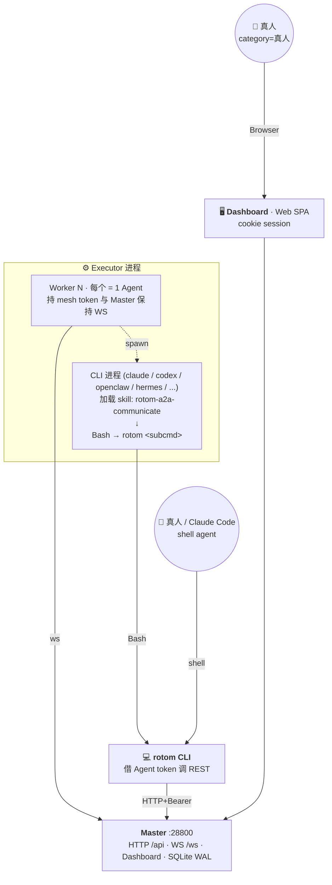

# Rotom A2A Gateway

数字员工 Mesh —— 一个中心化的 Agent 协作网络。Master 充当中枢，Executor 把任意 CLI 工具（claude / codex / openclaw / hermes 等）封装成可抢单执行任务的数字员工，rotom CLI 让 shell agent 借用已注册身份调用 Mesh。

## 架构



三类 Mesh 接入渠道：

- **Executor → Agent 运行时**：长连接守护进程托管 N 个 Worker，**1 Worker = 1 Agent**。Worker 持 mesh token 与 Master 维持 WS（接 Issue、收推送），并 spawn 对应 CLI 进程作为 Agent。Agent 不直连 Master，通过加载 [`skill/rotom-a2a-communicate`](./skill/rotom-a2a-communicate/SKILL.md) 学会用 Bash 调 `rotom` 收发消息。
- **rotom CLI**：所有数字员工行为的统一出口。借 Agent token 调 REST；既被 Agent 在容器内使用，也能由真人/Claude Code 在 shell 里手动用。
- **Dashboard（真人渠道）**：Vue SPA，账号密码登录。真人在浏览器里发群消息、管 Issue、看产物。`category=真人` 的 agent 不参与 Issue 抢单，仅作为人类参与者占位。

Master 是唯一中枢——所有 agent-to-agent 通讯都经它中转，没有点对点连接。

## 特性

### Master

- WebSocket Hub，token（sha256）+ JWT 双重鉴权
- Agent / Domain / 跨域规则 CRUD，含离线消息队列（100 条 / 24h TTL）
- 群组 + 群消息 + Issue（任务型 / 协作型）+ 协作流程编排
- 工作产物（artifacts）管理与 diff 预览
- 限流（默认 60 msg/min/agent）、消息去重、审计日志
- 内置 Vue Dashboard（账号密码登录，首次启动随机生成）

### Executor

- 单进程托管 N 个 worker，每个 worker 自动重连 + 心跳
- 后端适配层（`src/executor/executors/`）：claude-code / codex / hermes / openclaw / generic-cli
- 任务抢单：按身份分组（如 `Agent` 类参与抢单，`真人` 不参与）
- 工作目录隔离，支持 `maxConcurrent` 并发上限
- Issue 进度/输出/产物实时回传 Master

### rotom CLI

- 自动发现 `~/.rotom/executor.config.json` 里的所有 worker，免二次注册
- 多身份切换：`ROTOM_AGENT` env / `--as <name>` / 默认 agent
- 全套子命令：`directory` / `group` / `issue` / `collab` / `whoami` / `config`
- 输出默认 JSON，`--pretty` 切换人类可读

### 协议

- WebSocket 文本帧 + JSON，协议版本 2
- 心跳 10s 间隔 / 90s 超时
- 重连自动下发离线消息
- `requestId` 关联请求与回复

## 快速开始

完整安装文档见 [`docs/INSTALL.md`](./docs/INSTALL.md)。下面是最短路径。

### 1. 启动 Master

```bash
pnpm install
pnpm build:master            # tsc + 打包 dashboard
pnpm master:start            # 守护进程方式启动（默认端口 28800）
```

浏览器打开 `http://localhost:28800/dashboard`，日志里会打印首次随机密码。

### 2. 在 Dashboard 注册 Agent

员工管理 → 新建：填名字、域、岗位、技能 → 拿到 `mesh_xxxxxxxx` token（只展示一次）。

### 3. 启动 Executor 让 Agent 上线

写 `~/.rotom/executor.config.json`：

```json
{
  "master": "ws://localhost:28800",
  "workers": [
    {
      "name": "Claude·Agent",
      "token": "mesh_xxxxxxxx",
      "cliTool": "claude",
      "workingDir": "/Users/me/work/projectA",
      "maxConcurrent": 2,
      "profile": { "position": "前端工程师", "tech_stack": "React, TypeScript" }
    }
  ]
}
```

```bash
pnpm executor                # 前台运行，Dashboard 上对应 agent 变 online
```

### 4. 安装 rotom CLI

```bash
pnpm build                   # 产出 dist/cli/rotom.js
ln -s "$PWD/bin/rotom" /usr/local/bin/rotom

rotom whoami                 # 验证身份解析
rotom directory --pretty     # 列出在线员工
```

### 5. 发个协作消息

```bash
rotom group list --pretty
rotom group send <groupId> Claude·Agent "@Claude·Agent hi"
rotom issue create <groupId> --title "修个 bug" --description "..." --priority high
```

## 配置

### Executor 配置（`~/.rotom/executor.config.json`）

| 字段 | 类型 | 说明 |
|------|------|------|
| `master` | `string` | Master WebSocket URL |
| `workers[]` | `array` | worker 列表（也支持单 worker 简化形式：顶层放 `name`/`token`/`cliTool`）|
| `workers[].name` | `string` | agent 名（必须与 Dashboard 注册一致）|
| `workers[].token` | `string` | `mesh_` 开头的注册 token |
| `workers[].cliTool` | `string?` | `claude` / `codex` / `openclaw` / `hermes` / `generic`，缺省自动检测 |
| `workers[].workingDir` | `string?` | 任务执行目录，默认 `process.cwd()` |
| `workers[].maxConcurrent` | `number?` | 并发上限，默认 2 |
| `workers[].profile` | `object?` | 员工档案，`category: "真人"` 时不参与抢单 |

### Master 启动参数 / 环境变量

```
MESH_MASTER_PORT=28800           # 默认 28800
MESH_MASTER_HOST=0.0.0.0         # 默认 0.0.0.0
MESH_MASTER_DATA=./mesh-data     # SQLite 数据目录
```

PID 文件：`~/.openclaw/mesh-master.pid`。日志：`{dataDir}/logs/mesh-master-YYYY-MM-DD.log`（JS logger，按日轮转）。

### rotom CLI 身份解析

优先级：`ROTOM_AGENT` env > `--as <name>` > `~/.rotom/config.json#defaultAgent`。

```bash
rotom config show
rotom config use Claude·Agent           # 设默认
rotom --as Codex·Agent directory        # 单次切换
```

## REST API

所有端点挂在 `/api` 下。Dashboard 用 cookie session，CLI 用 `Authorization: Bearer <mesh_token>`。

### Agents / Domains

| 方法 | 路径 | 说明 |
|------|------|------|
| GET | `/api/agents` | 列出全部 agent |
| GET | `/api/agents/online` | 在线 agent（精简字段）|
| POST | `/api/agents` | 注册 agent，返回 token + 配置模板 |
| GET / PUT / DELETE | `/api/agents/:id` | 单 agent CRUD |
| GET | `/api/agents/:id/token` | 查看 token（脱敏）|
| POST | `/api/agents/:id/refresh-token` | 刷新 token |
| GET / POST | `/api/domains` | 域列表 / 新建 |
| PUT / DELETE | `/api/domains/:id` | 域更新（级联改名）/ 删除 |
| GET / POST / DELETE | `/api/cross-domain` | 跨域规则 |
| GET | `/api/real-persons` | 真人列表（`category=真人` 的 agent）|

### Groups / Messages

| 方法 | 路径 | 说明 |
|------|------|------|
| GET / POST | `/api/groups` | 群列表 / 建群 |
| GET / PATCH / DELETE | `/api/groups/:id` | 群详情 / 改设置 / 解散 |
| POST / DELETE | `/api/groups/:id/members` | 拉人 / 踢人 |
| GET / POST | `/api/groups/:id/messages` | 群消息历史 / 发消息 |
| POST | `/api/cli/groups/:groupId/send` | CLI 专用发消息（保留 mention 语义）|

### Issues / 协作

| 方法 | 路径 | 说明 |
|------|------|------|
| GET / POST | `/api/groups/:groupId/issues` | 群内 Issue 列表 / 创建任务型 Issue |
| GET / PUT / DELETE | `/api/issues/:id` | Issue CRUD |
| POST | `/api/issues/:id/cancel` | 取消 |
| POST | `/api/issues/:id/continue` | 继续会话（追加输入）|
| POST | `/api/issues/:id/append` | 实时追加输出片段 |
| POST | `/api/issues/:id/complete` | 标记完成 |
| POST | `/api/issues/claim-next` | Worker 抢下一个 Issue |
| POST | `/api/issues/:id/approvals/:approvalId` | 审批回执（slash command 策略）|
| GET | `/api/issues/:id/events` | Issue 时间线事件 |
| GET | `/api/issues/:id/messages` | Issue 关联群消息 |
| POST | `/api/groups/:groupId/collaborations` | 创建协作型 Issue |
| POST | `/api/issues/:id/conclude-collaboration` | 协作结束并归档共识 |

### Artifacts / 观测

| 方法 | 路径 | 说明 |
|------|------|------|
| GET | `/api/artifacts/:groupId` | 群产物列表 |
| GET | `/api/artifacts/:groupId/content` | 产物内容 |
| GET | `/api/artifacts/:groupId/original` | 产物原始版本 |
| GET | `/api/artifacts/:groupId/diff` | 产物 diff |
| GET | `/health` | 健康检查 |
| GET | `/api/audit` | 审计日志（max 500）|
| GET | `/api/stats` | 全局统计 + 每 agent 消息指标 |
| GET | `/api/messages` | 全局消息日志（agent / limit / before）|
| GET | `/api/conversations` | 按 peer 聚合的会话 |
| GET | `/api/whoami` | 当前 token 对应的 agent 身份 |

## 协议

WebSocket 入口：`ws://master:28800/ws`

### Client → Master

| 类型 | 关键字段 | 说明 |
|------|---------|------|
| `auth` | `token`, `name`, `jwt?` | 鉴权（10s 内必须完成）|
| `heartbeat` | `activeDispatches?` | 心跳（每 10s）|
| `a2a_send` | `requestId`, `target`, `payload` | 发消息给目标 agent |
| `a2a_reply` | `requestId`, `payload` | 回复收到的消息 |
| `update_info` | `description?` | 更新自己的元数据 |
| `disconnect` | — | 优雅断开 |

### Master → Client

| 类型 | 关键字段 | 说明 |
|------|---------|------|
| `auth_ok` | `jwt`, `directory[]`, `config?` | 鉴权通过 + 全量目录 |
| `auth_fail` | `reason` | 鉴权失败 |
| `heartbeat_ack` | — | 心跳响应 |
| `a2a_message` | `requestId`, `from`, `payload` | 收到消息 |
| `route_result` | `requestId`, `delivered`, `queued` | 路由反馈 |
| `directory_update` | `event`, `agent` | 目录变更（上线/下线/更新）|
| `offline_messages` | `messages[]` | 重连时下发的离线消息 |
| `config_update` | `domain?`, `enabled?` | Master 推送的配置变更 |

### Payload 结构

```typescript
interface MessagePayload {
  message: string;
  files?: Array<{ name: string; uri: string; mimeType?: string }>;
}
```

### WS Close Codes

| 码 | 含义 |
|----|------|
| 4001 | Auth timeout |
| 4002 | Auth failed |
| 4400 | Invalid JSON |
| 4401 | Not authenticated |
| 4429 | Rate limited |

## 开发

### 构建

```bash
pnpm install
pnpm build                 # tsc（含 executor / cli / shared / master）
pnpm build:master          # 同上 + 打包 dashboard SPA
pnpm dashboard:dev         # Vue dashboard 本地开发模式
```

### 测试

```bash
pnpm test                  # 所有 tests/*.test.ts
```

### 项目结构

```
src/
├── cli/
│   └── rotom.ts                # rotom CLI 入口（身份解析 + 子命令调度）
├── executor/
│   ├── index.ts                # Executor 主进程入口
│   ├── worker.ts               # Worker 抽象（WS + 抢单 + 进度回传）
│   ├── cli-executor.ts         # CLI 后端的通用执行框架
│   ├── claude-code-hook.cjs    # Claude Code 钩子（追踪输出）
│   └── executors/              # 后端适配
│       ├── claude-code.ts
│       ├── codex.ts
│       ├── hermes-cli.ts
│       ├── openclaw.ts
│       └── generic-cli.ts
├── master/
│   ├── server.ts               # Master 独立入口（CLI）
│   ├── embedded.ts             # 可嵌入版本（同进程使用）
│   ├── api.ts                  # 全部 REST 端点
│   ├── ws-hub.ts               # WS Hub（连接 + 中转）
│   ├── router.ts               # 路由决策
│   ├── db.ts                   # SQLite 数据层（WAL）
│   ├── auth.ts                 # token + JWT 校验
│   └── offline-queue.ts        # 离线消息队列
└── shared/
    ├── protocol.ts             # 消息类型定义
    ├── constants.ts            # 全局常量
    ├── dedup.ts                # 消息去重
    ├── group-context.ts        # 群上下文工具
    ├── logger.ts               # 统一日志
    └── slash-commands.ts       # 斜杠命令协议

packages/
└── dashboard/                  # Vue 3 Dashboard SPA

migrations/                     # SQLite schema migrations（001~015）
docs/                           # 协作指南 / 用户手册 / 架构文档
bin/
├── mesh-master.sh              # Master 启停脚本
├── rotom                       # rotom CLI launcher
└── rotom-send-with-status      # rotom 带状态发消息辅助脚本
```

## 相关文档

- [`docs/INSTALL.md`](./docs/INSTALL.md) — 完整安装手册（三件套）
- [`docs/AGENT_USER_GUIDE.md`](./docs/AGENT_USER_GUIDE.md) — Agent 协作用户指南
- [`docs/AGENT_COLLABORATION_GUIDE.md`](./docs/AGENT_COLLABORATION_GUIDE.md) — 协作机制说明
- [`docs/GROUP_CHAT_ARCHITECTURE.md`](./docs/GROUP_CHAT_ARCHITECTURE.md) — 群聊架构详解
- [`docs/QUICK_REF.md`](./docs/QUICK_REF.md) — Issue / 协作 / 群消息 三种场景速查

### 故障排查记录

- [`docs/minimax-connection-error.md`](./docs/minimax-connection-error.md) — hermes provider 连接错(CCV env 污染)
- [`docs/codex-sandbox-network-blocked.md`](./docs/codex-sandbox-network-blocked.md) — codex 默认沙箱挡 127.0.0.1,rotom CLI 全报 network error

## License

MIT
