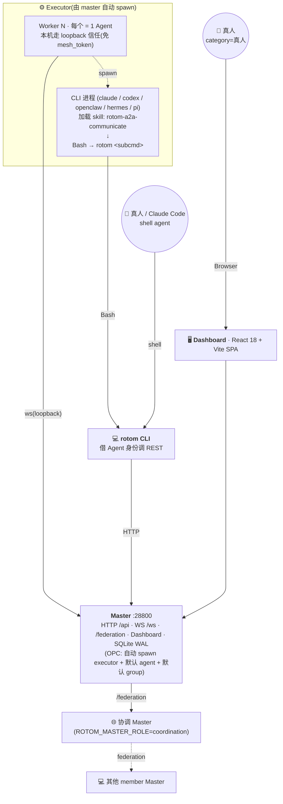

# Rotom A2A WORKSPACE

数字员工 Mesh —— 默认形态是**个人 OPC**(每台机器一个 master + executor,开箱即用、免 token、断网可用),可**联邦成团队**(多台机器协作)。Master 充当中枢,Executor 把任意 CLI 工具(claude / codex / openclaw / hermes / pi 等)封装成可抢单执行任务的数字员工,rotom CLI 让 shell agent 借用已注册身份调用 Mesh。

## 架构



三类 Mesh 接入渠道:

- **Executor → Agent 运行时**:master 自动 spawn 子进程,托管 N 个 Worker(**1 Worker = 1 Agent**)。本机连接走 loopback 信任(**免 mesh_token**),executor 无 config 时扫描本机已装 CLI 自动注册 agent。
- **rotom CLI**:所有数字员工行为的统一出口。借 Agent 身份调 REST;既被 Agent 在容器内使用,也能由真人/Claude Code 在 shell 里手动用。
- **Dashboard(真人渠道)**:React 18 + Vite SPA。真人在浏览器里发群消息、管 Issue、看产物、加入/离开团队。`category=真人` 的 agent 不参与 Issue 抢单,仅作为人类参与者占位。

Master 是唯一中枢——本机所有 agent-to-agent 通讯经它中转;跨机协作走 federation(协调 master 中转,星型拓扑)。

## 特性

### OPC 模式(默认,每台机器)

- **一命令开箱即用**:`mesh-master` 启动 = master + 自动 spawn executor + 默认 agent + 默认 group
- **免 mesh_token**:本机连接走 loopback 信任,agent 不存在自动注册
- **CLI 自动发现**:executor 扫描本机 claude/codex/hermes/openclaw/pi,每个 CLI 起一个 agent
- **masterId 持久稳定**:8 字符 base36,机器换网络/改 IP 不影响身份
- **hostname 校验**:拒绝 IP 字面量(移动电脑 IP 不稳定)

### Federation 团队(可选叠加)

- **星型拓扑**:协调 master(`ROTOM_MASTER_ROLE=coordination`)+ member master,跨机消息经协调中转
- **数据归属本地**:agent / memory / issue 始终留在本地 master;协调只持有路由元信息
- **runtime join/leave**:dashboard「团队」页填协调 master 地址即可加入,无需重启
- **移动电脑友好**:member 是 outbound 主动连接,切网自动重连;协调 master 需稳定地址

### Master

- WebSocket Hub,本机 loopback 信任 + 跨机 federation 协议
- Agent / 团队 / 跨团队可见性 CRUD,离线消息队列(100 条 / 24h TTL)
- 群组 + 群消息 + Issue(任务型 / 协作型)+ 协作流程编排
- 工作产物(artifacts)管理与 diff 预览
- 限流(默认 60 msg/min/agent)、消息去重、审计日志
- 内嵌 React 18 Dashboard

### Executor

- 由 master 自动 spawn 子进程(生命周期与 master 绑定)
- 后端适配层(`src/executor/executors/`):claude-code / codex / hermes-cli / openclaw / pi
- 无 config 时 scanClis 自动注册本机 CLI 为 agent
- 任务抢单:按身份分组(`Agent` 类参与抢单,`真人` 不参与)
- Issue 进度/输出/产物实时回传 Master

### rotom CLI

- 自动发现 `~/.rotom/executor.config.json` 里的所有 worker,免二次注册
- 多身份切换:`ROTOM_AGENT` env / `--as <name>` / 默认 agent
- 全套子命令:`directory` / `group` / `issue` / `whoami` / `config` / `memory` / `skill` / `schedule`
- 输出默认 JSON,`--pretty` 切换人类可读

### 协议

- WebSocket 文本帧 + JSON,协议版本 2(agent ↔ master);Federation 协议版本 1(master ↔ master)
- 心跳 10s 间隔 / 90s 超时
- 重连自动下发离线消息
- `requestId` 关联请求与回复

## 快速开始

完整安装文档见 [`docs/INSTALL.md`](./docs/INSTALL.md)。下面是最短路径 —— **无需克隆仓库**,全局装包即可。

### 0. 全局安装

```bash
tnpm i -g @alipay/rotom
# 或:npm i -g @alipay/rotom --registry=https://registry.antgroup-inc.cn
```

PATH 里多了 `mesh-master` 与 `rotom` 两个命令。

### 1. 一命令启动 OPC(默认 standalone)

```bash
rotom run opc
# = mesh-master start + 自动 spawn executor + 默认 agent + 默认 group
```

浏览器打开 `http://localhost:28800/dashboard`。master 自动:
- 生成 masterId(8 字符 base36,持久化在 `~/.rotom/master.json`)
- 建默认 agent(用 `os.userInfo().username`)+ 默认 group "Local"
- spawn 本机 executor 子进程
- executor 扫描本机 CLI,每个注册一个 agent(claude/codex/hermes/openclaw/pi)

**无需配 mesh_token** — 本机连接走 loopback 信任。

### 2. (可选)联邦成团队

**协调 master**(在某台稳定地址的机器上):

```bash
rotom run federation
# = ROTOM_MASTER_ROLE=coordination mesh-master start
```

**member master**(接入协调,移动电脑也行):

在 dashboard「团队」页填协调 master 地址(`ws://coord-host:28800`)+ 团队名,点「加入」即可(runtime 切换,无需重启)。或手动写 `~/.rotom/team.json`:

```json
{
  "id": "<协调 master 的 masterId>",
  "name": "阿甘团队",
  "coord_endpoints": ["ws://coord-host:28800"]
}
```

```bash
ROTOM_MASTER_ROLE=member ROTOM_TEAM_NAME="阿甘团队" rotom run opc
```

加入后:本机 agent 自动发布到协调 master,其他 member 可见;跨机消息经协调中转。数据归属本地(协调只持有路由元信息)。

### 3. 验证 + 发个协作消息

```bash
rotom whoami                 # 验证身份解析
rotom directory --pretty     # 列出在线员工
rotom group list --pretty
rotom group send <groupId> <agent> "@<agent> hi"
rotom issue create <groupId> --title "修个 bug" --description "..." --priority high
```

> **源码开发**:需要改 rotom 源码 / 跑测试 / 提 PR 时,见 [INSTALL.md 方式 B](./docs/INSTALL.md#方式-b源码安装开发--贡献代码用)。

## 配置

### Master 启动参数 / 环境变量

| 变量 | 默认 | 说明 |
|------|------|------|
| `MESH_MASTER_PORT` | `28800` | Master 监听端口 |
| `MESH_MASTER_HOST` | `0.0.0.0` | Master 监听地址 |
| `ROTOM_HOME` | `~/.rotom` | 数据目录(SQLite + 日志 + PID) |
| `ROTOM_HOSTNAME` | `os.hostname()` | 本机 hostname(联邦用,**禁止填 IP**) |
| `ROTOM_MASTER_ROLE` | `standalone` | `standalone` / `coordination` / `member` |
| `ROTOM_TEAM_NAME` | 从真人 agent 派生 | 团队展示名(如"西花团队") |
| `ROTOM_COORD_ENDPOINTS` | — | member 模式:逗号分隔协调 master ws 地址 |
| `ROTOM_FEDERATION_DISABLED` | — | `=1` 强制关闭联邦 |

日志:`{ROTOM_HOME}/logs/mesh-master-YYYY-MM-DD.log`(按日轮转)。

### Executor 配置(`~/.rotom/executor.config.json`,可选)

OPC 模式下 master 自动生成 `.auto-executor.json`(scanClis 模式),无需手写。若要给 agent 起中文名或指定 workingDir,写 `executor.config.json`(优先级高于 auto):

```json
{
  "master": "ws://localhost:28800",
  "workers": [
    {
      "name": "江德福",
      "cliTool": "claude",
      "workingDir": "/Users/me/work/projectA",
      "maxConcurrent": 2,
      "profile": { "position": "全栈工程师", "bio": "主力绝对主力" }
    }
  ]
}
```

| 字段 | 类型 | 说明 |
|------|------|------|
| `master` | `string` | Master WebSocket URL |
| `workers[]` | `array` | worker 列表(也支持单 worker 简化形式) |
| `workers[].name` | `string` | agent 名(OPC 模式下本机信任,无需与 DB 预注册) |
| `workers[].token` | `string?` | **OPC 模式可空**(本机信任);跨机连接远程 master 时必填 |
| `workers[].cliTool` | `string?` | `claude` / `codex` / `openclaw` / `hermes` / `pi`,缺省自动检测 |
| `workers[].workingDir` | `string?` | 任务执行目录,默认 `~/.rotom/workspace` |
| `workers[].maxConcurrent` | `number?` | 并发上限,默认 2 |
| `workers[].profile` | `object?` | 员工档案,`category: "真人"` 时不参与抢单 |

### 团队配置(`~/.rotom/team.json`,member 模式)

```json
{
  "id": "<协调 master 的 masterId,8 字符 base36>",
  "name": "阿甘团队",
  "coord_endpoints": ["ws://coord-host:28800"]
}
```

也可通过 dashboard「团队」页的「加入上级团队」表单 runtime 生成(无需重启)。

### rotom CLI 身份解析

优先级:`ROTOM_AGENT` env > `--as <name>` > `~/.rotom/config.json#defaultAgent`。

```bash
rotom config show
rotom config use 江德福           # 设默认
rotom --as 阿甘 directory        # 单次切换
```

## REST API

所有端点挂在 `/api` 下。本机调用走 loopback 信任(免 token);远程用 `Authorization: Bearer <mesh_token>`(向后兼容)。

### Identity / Teams(federation)

| 方法 | 路径 | 说明 |
|------|------|------|
| GET | `/api/identity` | 本机 master 身份(masterId / hostname / role / teamName) |
| GET | `/api/teams` | 已加入的团队列表 |
| GET | `/api/teams/:id/members` | 团队内可见 agent(agent_visibility) |
| GET | `/api/teams/:id/peers` | 团队内 peer master 列表 |
| POST | `/api/teams/join` | runtime 加入上级团队(body: `{ coordEndpoint, teamName? }`) |
| POST | `/api/teams/leave` | runtime 离开团队,切回 standalone |
| POST | `/api/agents/:id/refresh-token` | 刷新 token |
| GET / POST | `/api/domains` | 域列表 / 新建 |
| PUT / DELETE | `/api/domains/:id` | 域更新（级联改名）/ 删除 |
| GET / POST / DELETE | `/api/cross-domain` | 跨域规则 |
| GET | `/api/real-persons` | 真人列表（`category=真人` 的 agent）|

### Groups / Messages

| 方法 | 路径 | 说明 |
|------|------|------|
| GET / POST | `/api/groups` | 群列表 / 建群 |
| GET / PATCH / DELETE | `/api/groups/:id` | 群详情 / 改设置 / 解散 |
| POST / DELETE | `/api/groups/:id/members` | 拉人 / 踢人 |
| GET / POST | `/api/groups/:id/messages` | 群消息历史 / 发消息 |
| POST | `/api/cli/groups/:groupId/send` | CLI 专用发消息（保留 mention 语义）|

### Issues / 协作

| 方法 | 路径 | 说明 |
|------|------|------|
| GET / POST | `/api/groups/:groupId/issues` | 群内 Issue 列表 / 创建任务型 Issue |
| GET / PUT / DELETE | `/api/issues/:id` | Issue CRUD |
| POST | `/api/issues/:id/cancel` | 取消 |
| POST | `/api/issues/:id/continue` | 继续会话（追加输入）|
| POST | `/api/issues/:id/append` | 实时追加输出片段 |
| POST | `/api/issues/:id/complete` | 标记完成 |
| POST | `/api/issues/claim-next` | Worker 抢下一个 Issue |
| POST | `/api/issues/:id/approvals/:approvalId` | 审批回执（slash command 策略）|
| GET | `/api/issues/:id/events` | Issue 时间线事件 |
| GET | `/api/issues/:id/messages` | Issue 关联群消息 |

### Artifacts / 观测

| 方法 | 路径 | 说明 |
|------|------|------|
| GET | `/api/artifacts/:groupId` | 群产物列表 |
| GET | `/api/artifacts/:groupId/content` | 产物内容 |
| GET | `/api/artifacts/:groupId/original` | 产物原始版本 |
| GET | `/api/artifacts/:groupId/diff` | 产物 diff |
| GET | `/health` | 健康检查 |
| GET | `/api/audit` | 审计日志（max 500）|
| GET | `/api/stats` | 全局统计 + 每 agent 消息指标 |
| GET | `/api/messages` | 全局消息日志（agent / limit / before）|
| GET | `/api/conversations` | 按 peer 聚合的会话 |
| GET | `/api/whoami` | 当前 token 对应的 agent 身份 |

## 协议

WebSocket 入口：`ws://master:28800/ws`

### Client → Master

| 类型 | 关键字段 | 说明 |
|------|---------|------|
| `auth` | `token`, `name`, `jwt?` | 鉴权（10s 内必须完成）|
| `heartbeat` | `activeDispatches?` | 心跳（每 10s）|
| `a2a_send` | `requestId`, `target`, `payload` | 发消息给目标 agent |
| `a2a_reply` | `requestId`, `payload` | 回复收到的消息 |
| `update_info` | `description?` | 更新自己的元数据 |
| `disconnect` | — | 优雅断开 |

### Master → Client

| 类型 | 关键字段 | 说明 |
|------|---------|------|
| `auth_ok` | `jwt`, `directory[]`, `config?` | 鉴权通过 + 全量目录 |
| `auth_fail` | `reason` | 鉴权失败 |
| `heartbeat_ack` | — | 心跳响应 |
| `a2a_message` | `requestId`, `from`, `payload` | 收到消息 |
| `route_result` | `requestId`, `delivered`, `queued` | 路由反馈 |
| `directory_update` | `event`, `agent` | 目录变更（上线/下线/更新）|
| `offline_messages` | `messages[]` | 重连时下发的离线消息 |
| `config_update` | `domain?`, `enabled?` | Master 推送的配置变更 |

### Payload 结构

```typescript
interface MessagePayload {
  message: string;
  files?: Array<{ name: string; uri: string; mimeType?: string }>;
}
```

### WS Close Codes

| 码 | 含义 |
|----|------|
| 4001 | Auth timeout |
| 4002 | Auth failed |
| 4400 | Invalid JSON |
| 4401 | Not authenticated |
| 4429 | Rate limited |

## 开发(源码方式)

普通用户走 `tnpm i -g @alipay/rotom` 全局装包即可,无需读这一节。本节面向需要改 rotom 源码 / 跑测试 / 提 PR 的开发者。

### 构建

```bash
git clone <repo> rotom && cd rotom
pnpm install
pnpm build                 # tsc（含 executor / cli / shared / master）
pnpm build:master          # 同上 + 打包 dashboard SPA
pnpm dashboard:dev         # React dashboard 本地开发模式
```

### 测试

```bash
pnpm test                  # 所有 tests/*.test.ts
```

### 项目结构

```
src/
├── cli/
│   └── rotom.ts                # rotom CLI 入口（身份解析 + 子命令调度）
├── executor/
│   ├── index.ts                # Executor 主进程入口
│   ├── worker.ts               # Worker 抽象（WS + 抢单 + 进度回传）
│   ├── cli-executor.ts         # CLI 后端的通用执行框架
│   ├── claude-code-hook.cjs    # Claude Code 钩子（追踪输出）
│   └── executors/              # 后端适配
│       ├── claude-code.ts
│       ├── codex.ts
│       ├── hermes-cli.ts
│       ├── openclaw.ts
│       └── pi.ts
├── master/
│   ├── server.ts               # Master 独立入口（CLI）— OPC bootstrap + federation 启动
│   ├── embedded.ts             # 可嵌入版本（同进程使用）
│   ├── opc-bootstrap.ts        # OPC bootstrap:身份 + 默认 agent/group + spawn executor
│   ├── federation/             # 联邦子系统（identity / manager / server / client / publisher）
│   ├── api/                    # REST 端点（agents / teams / groups / issues / memory / ...）
│   ├── ws-hub/                 # WS Hub（连接 + 中转 + 路由 + directory）
│   ├── router.ts               # 路由决策（含 routeFederated 跨机分支）
│   ├── db/                     # SQLite 数据层（WAL,master-node / team / agent-visibility / ...）
│   ├── auth.ts                 # token + JWT + authenticateLocal（本机信任）
│   └── offline-queue.ts        # 离线消息队列
└── shared/
    ├── protocol/               # 消息类型（client/server/federation + guards）
    ├── network.ts              # isLoopback（本机信任判定）
    ├── constants.ts            # 全局常量
    ├── dedup.ts                # 消息去重
    ├── group-context.ts        # 群上下文工具
    ├── logger.ts               # 统一日志
    └── slash-commands.ts       # 斜杠命令协议

packages/
└── dashboard/                  # React 18 + Vite Dashboard SPA

migrations/                     # SQLite schema migrations(001~058)
docs/                           # 协作指南 / 用户手册 / 架构文档
bin/
├── mesh-master.sh              # Master 启停脚本
├── rotom                       # rotom CLI launcher
└── rotom-send-with-status      # rotom 带状态发消息辅助脚本
```

## 相关文档

- [`docs/INSTALL.md`](./docs/INSTALL.md) — 完整安装手册（三件套）
- [`docs/AGENT_USER_GUIDE.md`](./docs/AGENT_USER_GUIDE.md) — Agent 协作用户指南
- [`docs/AGENT_COLLABORATION_GUIDE.md`](./docs/AGENT_COLLABORATION_GUIDE.md) — 协作机制说明
- [`docs/GROUP_CHAT_ARCHITECTURE.md`](./docs/GROUP_CHAT_ARCHITECTURE.md) — 群聊架构详解
- [`docs/QUICK_REF.md`](./docs/QUICK_REF.md) — Issue / 协作 / 群消息 三种场景速查

### 故障排查记录

- [`docs/minimax-connection-error.md`](./docs/minimax-connection-error.md) — hermes provider 连接错(CCV env 污染)
- [`docs/codex-sandbox-network-blocked.md`](./docs/codex-sandbox-network-blocked.md) — codex 默认沙箱挡 127.0.0.1,rotom CLI 全报 network error

## License

MIT
