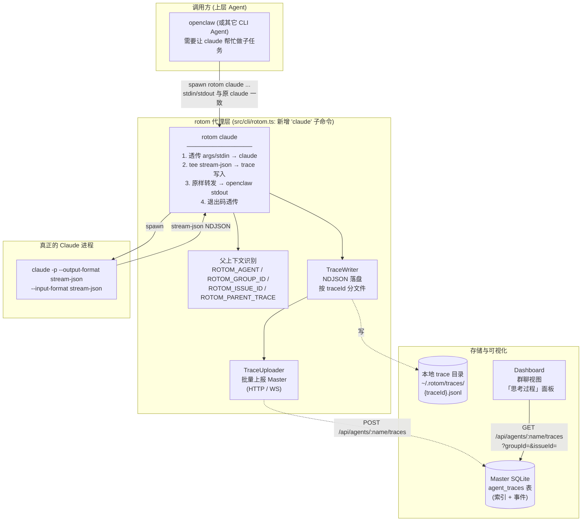
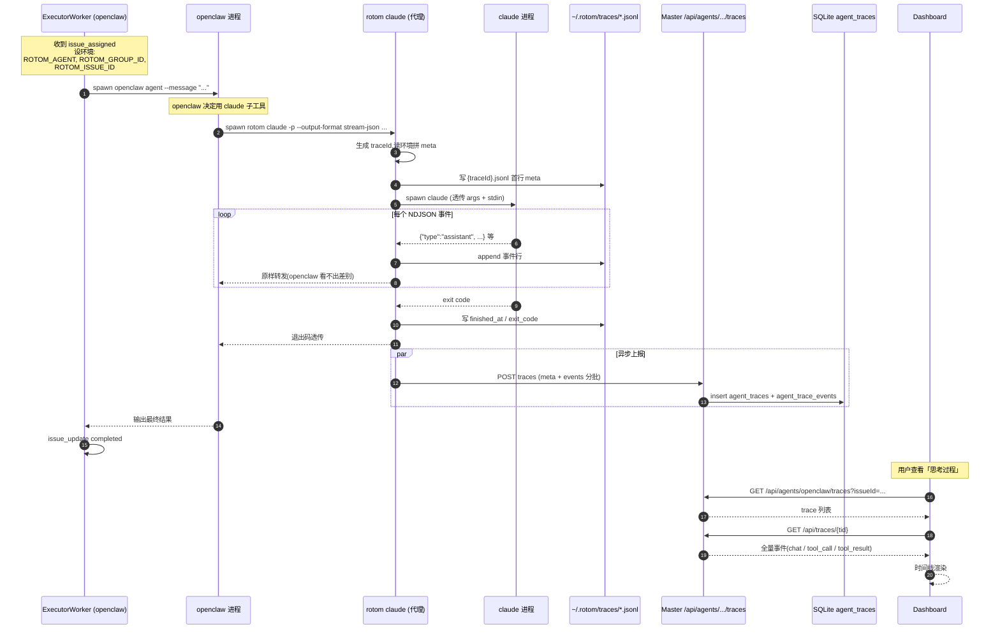

# Agent 流程白盒化架构

把 **Claude Code 的执行过程**(chat 推理 / 工具调用 / 工具结果) 抽出来集中存储、可视化的架构设计。

**核心思路**:让 openclaw(或其它「上层 Agent」) **通过 rotom 间接调用 claude**,由 rotom 充当代理层,在转发过程中**捕获 stream-json 全量事件并持久化**,Dashboard 据此还原 claude 的完整推理轨迹。

> 配套文档:`docs/GROUP_CHAT_ARCHITECTURE.md`(群聊整体架构)

## 0. 为什么需要这层代理

现状(`src/executor/executors/`):

| 后端 | 输出协议 | 可见度 |
|------|----------|--------|
| `claude-code.ts` | `claude -p --output-format stream-json` NDJSON | ✅ chat / tool_use / tool_result 全可见 |
| `openclaw.ts` | openclaw 自家 NDJSON (text / tool_use / tool_result / lifecycle) | ✅ 自身可见 |
| `codex.ts` / `generic-cli.ts` | 纯 stdout | ❌ 不可见 |

但有个**盲区**:当 openclaw **内部调用 claude** 作为子工具时,这次 claude 的执行对外只暴露 openclaw 的「文本输出」,**claude 自己那层 chat/tool 链路丢了**。Dashboard 看到的是 openclaw 的成品,看不到 claude 是怎么一步步推到这个结论的。

解决方案:**openclaw 不直接 spawn `claude`,而是 spawn `rotom claude ...`**。rotom 作为中间人:
1. 转发 args / stdin 给真正的 `claude` 进程
2. **解析 claude 的 stream-json 输出**,把每个事件写进 trace 存储,再原样回吐给 openclaw
3. trace 带上**父上下文**(谁调用的、属于哪个 issue / 群)
4. 后续 Dashboard / Master 都能按 `parent agent × group × issue` 反查 claude 这层的执行细节

## 1. 整体架构



## 2. 关键设计

### 2.1 透明代理:rotom 的 stdin/stdout 与 claude 完全一致

调用方完全感知不到 rotom 存在,只需把 `claude` 替换成 `rotom claude`:

```bash
# 原来 openclaw 内部
claude -p --output-format stream-json --input-format stream-json --resume <sid>

# 现在
rotom claude -p --output-format stream-json --input-format stream-json --resume <sid>
#     ^^^^^^ 仅多一个前缀,其它参数/stdin/stdout 完全透传
```

实现:`rotom claude` 把除自身识别的 flag 之外的所有 args 透传给 `claude`,stdin pipe through,stdout 一边写 trace 一边吐给上层。

> 同样的代理模式可以扩展到 `rotom codex`、`rotom aider`,后续不展开。

### 2.2 trace 数据模型

每次「openclaw → rotom → claude」生成一个 trace:

```ts
interface AgentTrace {
  traceId: string;                 // 本次代理的唯一 ID(rotom 生成)
  parentAgent: string;             // 谁发起的(openclaw 的 agent name,从 ROTOM_AGENT)
  innerTool: "claude" | "codex";   // 被代理的 CLI
  innerSessionId?: string;         // claude --resume / system event 里拿到的 session_id
  groupId?: string;                // ROTOM_GROUP_ID
  issueId?: string;                // ROTOM_ISSUE_ID
  parentTraceId?: string;          // 嵌套调用时上一层 trace,支持「trace 树」
  startedAt: string;
  finishedAt?: string;
  exitCode?: number;
  events: TraceEvent[];            // 全量 stream-json 事件 + 时间戳
}

interface TraceEvent {
  ts: number;
  // 直接保留 claude stream-json 的原始 shape,前端解析时复用现有逻辑
  type: "system" | "assistant" | "user" | "result";
  raw: unknown;
}
```

落盘格式:`~/.rotom/traces/{traceId}.jsonl`,首行 meta、后续每行一个事件,**用 NDJSON 就是为了边写边读、断点续传**。

### 2.3 父上下文如何注入

openclaw / 上层 worker spawn `rotom claude` 时通过**环境变量**传递:

| 环境变量 | 由谁设置 | 用途 |
|----------|----------|------|
| `ROTOM_AGENT` | ExecutorWorker spawn openclaw 时已设(已存在) | 标识发起方 agent |
| `ROTOM_GROUP_ID` | **新增**:worker 处理群消息 / issue 时注入 | 关联到群 |
| `ROTOM_ISSUE_ID` | **新增**:worker 执行 issue 时注入 | 关联到 issue |
| `ROTOM_PARENT_TRACE` | **新增**:嵌套 rotom 代理调用时由上一层 rotom 注入 | 构成 trace 树 |
| `ROTOM_TRACE_DISABLE` | **新增**(可选) | 关闭 trace(性能 / 隐私场景) |

> openclaw 完全不用改代码 —— 只要环境变量在,trace 就能挂到正确的群/issue 上。

### 2.4 存储分层:本地优先,Master 异步聚合

```
┌─────────────────────────────────────────────────────────────┐
│  rotom claude 进程                                            │
│   ┌──────────────────────────────────────────────┐          │
│   │ 实时 tee:每个 stream-json 事件                 │          │
│   │   ① 转发给 openclaw stdout(同步,不能阻塞)     │          │
│   │   ② append 到本地 ~/.rotom/traces/{tid}.jsonl │          │
│   └──────────────────────────────────────────────┘          │
│                         │                                     │
│                         ▼ (进程退出 / 周期 flush)              │
│   ┌──────────────────────────────────────────────┐          │
│   │ TraceUploader(后台 / 批量)                    │          │
│   │   POST {master}/api/agents/{parentAgent}/traces│         │
│   │   失败 → 留在本地,下次启动重试                  │          │
│   └──────────────────────────────────────────────┘          │
└─────────────────────────────────────────────────────────────┘
                          │
                          ▼
        Master:agent_traces 表(索引) + 事件 BLOB / JSONL 引用
```

设计要点:
- **不阻塞调用方**:本地写盘是同步的(NDJSON append 很快),Master 上传**异步**进行
- **跨节点友好**:Executor 在远端时,Dashboard 仍能从 Master DB 拉到完整 trace,无需 WS 回拉本地文件
- **降级路径**:Master 不可达时,trace 留在本地,`rotom` 启动时自动补传

### 2.5 Master 侧:新增表 + REST

`migrations/00X-agent-traces.sql`(新):

```sql
CREATE TABLE agent_traces (
  trace_id          TEXT PRIMARY KEY,
  parent_agent      TEXT NOT NULL,
  inner_tool        TEXT NOT NULL,     -- 'claude' | 'codex' | ...
  inner_session_id  TEXT,
  group_id          TEXT,
  issue_id          TEXT,
  parent_trace_id   TEXT,
  started_at        TEXT NOT NULL,
  finished_at       TEXT,
  exit_code         INTEGER,
  event_count       INTEGER DEFAULT 0
);
CREATE INDEX idx_traces_agent_group ON agent_traces(parent_agent, group_id);
CREATE INDEX idx_traces_issue ON agent_traces(issue_id);

CREATE TABLE agent_trace_events (
  id          INTEGER PRIMARY KEY AUTOINCREMENT,
  trace_id    TEXT NOT NULL REFERENCES agent_traces(trace_id) ON DELETE CASCADE,
  ts          INTEGER NOT NULL,
  type        TEXT NOT NULL,           -- 'system' | 'assistant' | 'user' | 'result'
  raw         TEXT NOT NULL            -- 原始 stream-json 行
);
CREATE INDEX idx_trace_events ON agent_trace_events(trace_id, id);
```

REST:

| 方法 | 路径 | 用途 |
|------|------|------|
| POST | `/api/agents/:name/traces` | rotom 上报 trace(meta + events,可分批) |
| GET | `/api/agents/:name/traces?groupId=&issueId=` | Dashboard 列 trace |
| GET | `/api/traces/:traceId` | 拉单个 trace 的事件流(可分页) |

## 3. 时序:openclaw 借 claude 帮忙的一次完整流程



## 4. Dashboard 时间线渲染

复用 `packages/dashboard/.../MarkdownContent.tsx` 已有的 tool tag 解析(`claude-code.ts:411` 注释里描述的 `[tool:exec]` / `[tool:patch]` / `[tool-result:exec]` 词汇)。

trace 事件转换:
- claude `system` 事件 → 头部信息(model / session_id)
- claude `assistant` 含 text → 💬 chat
- claude `assistant` 含 tool_use → 🔧 tool_call(沿用 `describeToolUseForLog` 分类:exec / patch / ask)
- claude `user` 含 tool_result → 📤 tool_result(exec 显示,patch 折叠)
- claude `result` → ✅ 完成标记

群聊视图中:某条 openclaw 的对外回复旁边,可点开「查看 claude 思考过程」抽屉,加载该 issue/消息对应 traceId 列表。

## 5. 关键改动清单

| 模块 | 文件 | 改动 |
|------|------|------|
| **rotom CLI** | `src/cli/rotom.ts` | 新增 `claude` 子命令(后续 `codex` 同模式) |
| **rotom CLI** | `src/cli/trace-writer.ts`(新) | TraceWriter:本地 NDJSON 落盘 |
| **rotom CLI** | `src/cli/trace-uploader.ts`(新) | 后台批量上报 + 失败重试 |
| **Executor** | `src/executor/worker.ts` | spawn 子进程时多注入 `ROTOM_GROUP_ID` / `ROTOM_ISSUE_ID` |
| **openclaw 适配** | 上游 openclaw 配置(项目外) | 把内部 `claude` 命令换成 `rotom claude` |
| **Master DB** | `migrations/00X-agent-traces.sql` | 新表 `agent_traces` / `agent_trace_events` |
| **Master API** | `src/master/api.ts` | 新 REST:POST/GET traces |
| **Dashboard** | `packages/dashboard/src/features/.../` | 群聊视图新增「思考过程」抽屉 |
| **协议** | `src/shared/protocol.ts` | 暂不动 WS;trace 走 HTTP |

## 6. 落地分阶段

| 阶段 | 范围 | 价值 |
|------|------|------|
| **P0** | rotom claude 代理 + 本地 NDJSON 落盘(无 Master 同步)、本地 CLI 工具能查 trace | 最小闭环,验证转发不破坏 openclaw |
| **P1** | TraceUploader → Master DB → Dashboard 列表 + 单 trace 详情页 | 跨节点可视化 |
| **P2** | trace 树(嵌套代理)、按 issue / 群聊聚合视图 | 多 Agent 协作可观测 |
| **P3** | rotom codex / rotom aider 同模式接入;trace 检索 / 全文搜索 | 多 CLI 统一白盒 |

## 7. 与现有系统的关系

- **不破坏现有调用方**:`rotom claude` 是新子命令,旧的 `claude` 直接调用照旧
- **不污染 `group_messages`**:trace 走单独 `agent_traces` 表,只通过 group_id/issue_id 关联
- **与 Issue 系统正交**:issue 已有 `issue_events`,trace 可在 Dashboard 中合并展示
- **与 `SessionStore` 兼容**:`~/.rotom/sessions.json` 仍维护 `cliTool × sessionKey → sessionId`,rotom claude 透传 `--resume` 时,trace 的 `innerSessionId` 与之对齐

## 8. 已知风险

- **性能**:多一层进程 fork + NDJSON 解析。stream-json 单事件通常 <10KB,实测开销可忽略,但需 benchmark
- **stdin 透传**:openclaw 用 stream-json 输入格式时,rotom 需正确 pipe stdin 且不缓冲,否则会卡 claude 等待输入
- **退出码 / 信号**:SIGTERM / SIGKILL 必须透传给 claude,避免代理层吞掉 abort 信号
- **存储膨胀**:长会话 trace 可能 MB 级,需要 TTL 策略(本地 + Master 都要)
- **隐私**:trace 含完整 prompt / 工具输入输出,可能含敏感数据,Master 侧需做权限校验(谁能看哪个 agent 的 trace)
- **PATH 检测**:`rotom claude` 内部需找到真正的 `claude` 可执行;通过 `which claude` 解析,避免递归调用自己
