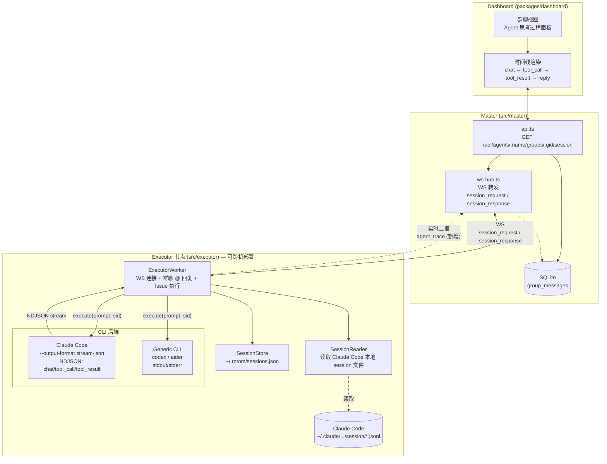
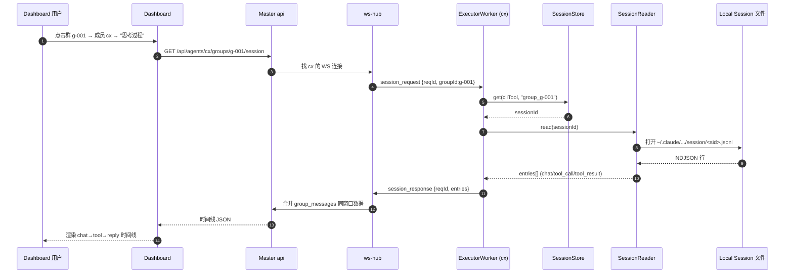

# Agent 流程白盒化架构

把 Claude Code / Codex 等 CLI 后端的内部「思考过程」(chat、tool_call、tool_result) 抽取出来,在 Dashboard 上以时间线形式可视化的架构设计。

> 配套文档:`docs/GROUP_CHAT_ARCHITECTURE.md`(群聊整体架构)

## 0. 目标

让运维 / 业务方在 Dashboard 上**像看人聊天一样看 Agent 工作**:

- 选群 G → 选 Agent(如 cx) → 查看 cx 在此群的完整活动时间线
- 时间线包含:
  - 群内对外发言/回复(已有)
  - CLI 后端的 chat 内容(LLM 推理)
  - 工具调用(tool_call) + 工具结果(tool_result)
  - 最终回复

核心收益:**问题排查可追溯、Agent 行为可审计、协作过程可复盘**。

## 1. CLI 后端能力对比

不同 CLI 的输出协议决定了白盒化粒度:

| 维度 | Claude Code | Codex / Aider (Generic) |
|------|-------------|-------------------------|
| 命令 | `claude -p ... --output-format stream-json` | `codex "prompt"` |
| 输出协议 | NDJSON,每行带 `type` 字段 | 纯 stdout/stderr 文本流 |
| chat 可见 | ✅ 原生 | ❌ 需自行解析 |
| tool_call 可见 | ✅ 原生 | ❌ 无结构化标记 |
| tool_result 可见 | ✅ 原生 | ❌ 无结构化标记 |
| 本地 session 文件 | ✅ 完整 chat + tool 链路 | 依赖具体 CLI |
| 白盒化难度 | 低(直接转发) | 高(需约定协议或正则解析) |

> 结论:**优先打通 Claude Code 链路**,Codex 等通过约定输出格式或 session 文件适配。

## 2. 数据来源

```
┌────────────────────────────────────────────────────────────────┐
│  数据来源 (按可信度 & 完整度排序)                                  │
├────────────────────────────────────────────────────────────────┤
│                                                                │
│  ① CLI stream-json 实时流  (Claude Code)                        │
│     ExecutorWorker 解析每行 NDJSON → 实时上报                    │
│     ✅ 实时性最好  ✅ 结构化完整  ❌ 仅 Claude Code 原生支持        │
│                                                                │
│  ② Executor 本地 session 文件                                   │
│     Claude Code session 目录 / SessionStore                    │
│     ✅ 历史完整  ✅ 不依赖实时上报  ❌ 跨节点需远程拉取             │
│                                                                │
│  ③ group_messages (SQLite)                                     │
│     现有,只含对外发言/回复,不含内部 chat / tool 调用              │
│     ✅ 已有  ❌ 信息粒度粗                                       │
│                                                                │
└────────────────────────────────────────────────────────────────┘
```

会话隔离规则(`docs/GROUP_CHAT_ARCHITECTURE.md` §8 第 5 条):
- 群消息 sessionKey = `group_<groupId>`
- 私聊 sessionKey = 对方名字
- Executor 的 `SessionStore`(`~/.rotom/sessions.json`)按「CLI 后端 × sessionKey」持久化 sessionId

## 3. 整体架构



## 4. 关键改造点

### 4.1 协议层 (`src/shared/protocol.ts`)

新增消息类型:

| 方向 | 类型 | 说明 |
|------|------|------|
| master→agent | `session_request` | `{requestId, groupId}` 拉取该群完整 session |
| agent→master | `session_response` | `{requestId, entries:[...]}` 回传时间线 |
| agent→master | `agent_trace` (实时) | `{groupId, type:"chat\|tool_call\|tool_result", content, ts}`,用于实时推流 |

> 实时 `agent_trace` 与离线 `session_request` 二选一或互补;首版可只做离线拉取,降低复杂度。

### 4.2 Executor 侧 (`src/executor/`)

- **ClaudeCodeExecutor**:在解析 `stream-json` 每行时,除了拼 `fullOutput`,额外按 `type` 分类回调上层(chat / tool_call / tool_result)
- **新增 `session-reader.ts`**:根据 sessionId 在本地文件系统定位 Claude Code 的 session 文件(通常为 jsonl),按行解析并返回结构化条目
- **`worker.ts`**:接收 `session_request` → 通过 `SessionStore` 查 sessionId → `SessionReader` 读文件 → 回 `session_response`

### 4.3 Master 侧 (`src/master/`)

- **`api.ts`** 新增 `GET /api/agents/:name/groups/:groupId/session`:
  - 找到该 agent 的在线 WS 连接
  - 发 `session_request` → 等 `session_response` → 拼接 `group_messages` 同窗口数据 → 返回时间线
  - 离线 / 跨节点无 session 时降级返回仅 `group_messages`
- **`ws-hub.ts`**:复用 `pendingRequests` 模式做 request/response 关联

### 4.4 Dashboard 侧 (`packages/dashboard`)

- 群聊视图右栏(或抽屉)新增「Agent 思考过程」面板
- 列出本群成员,点击成员 → 拉 `/api/agents/:name/groups/:gid/session` → 渲染时间线
- 节点类型可视化:
  - 💬 chat — 折叠/展开显示推理文本
  - 🔧 tool_call — 显示工具名 + 参数
  - 📤 tool_result — 显示结果摘要(可展开)
  - 📨 reply — 对外发言,与群消息时间线对齐

## 5. 数据流时序

**场景**:运维查看 Agent `cx` 在群 `g-001` 的思考过程



## 6. 落地分阶段

| 阶段 | 范围 | 价值 |
|------|------|------|
| **P0** | Claude Code 离线拉取:Executor 端实现 SessionReader + Master 加 REST + Dashboard 简单时间线 | 闭环可视化,验证产品形态 |
| **P1** | 实时 `agent_trace` 推送:Worker 边执行边推 chat/tool 节点,Dashboard 实时刷新 | 长任务可观测 |
| **P2** | Codex / Aider 适配:约定输出格式 or 解析 stdout 模式 | 多 CLI 后端统一 |
| **P3** | 持久化到 Master DB:新增 `agent_traces` 表,支持跨节点 / 离线 Agent 历史查询 | 跨节点审计 |

## 7. 与现有系统的关系

- 不破坏现有协议:新增消息类型,旧客户端忽略即可
- 不污染 `group_messages`:对外发言仍走原路径,内部 chat / tool 单独通道
- 与 Issue 系统正交:Issue 已有 `issue_events` 时间线,可在「思考过程」面板中合并展示同窗口的 issue 事件

## 8. 已知风险

- **session 文件路径不稳定**:Claude Code 升级可能改目录,需做版本适配
- **跨节点延迟**:Executor 在远端时,WS 来回 + 文件读 IO 可能较慢,需加 loading & 超时降级
- **隐私 / 安全**:session 文件含完整 prompt 与工具结果(可能含敏感数据),需在 Master 侧加权限校验(谁能看哪个 agent 的思考过程)
- **数据量**:长会话 session 文件可能 MB 级,需要分页或按时间窗口裁剪
