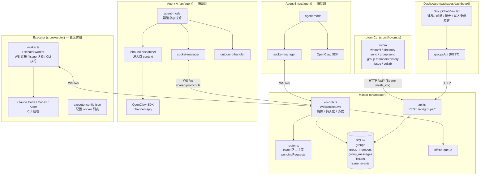
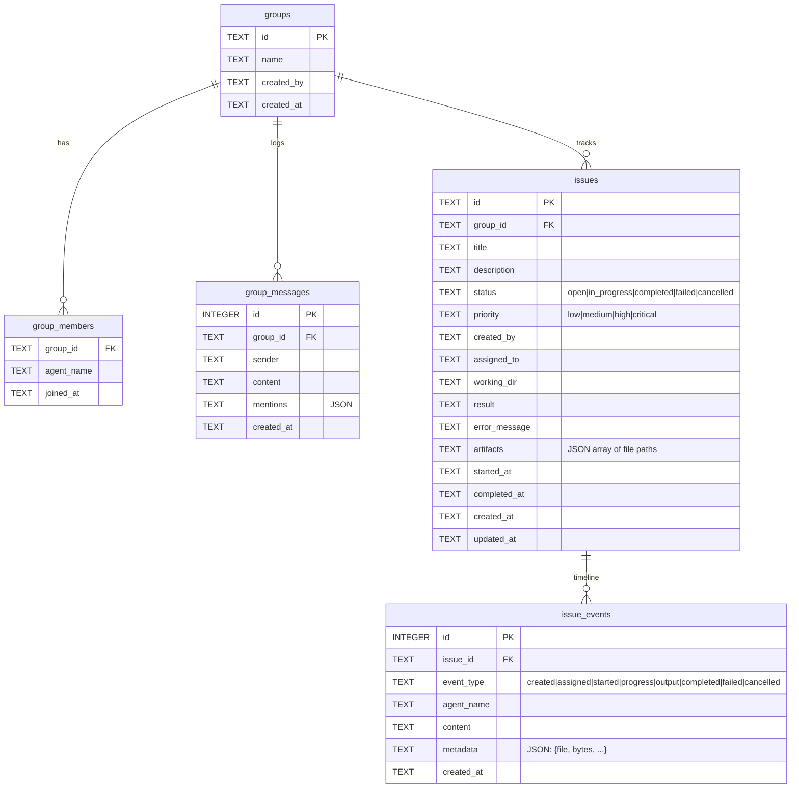
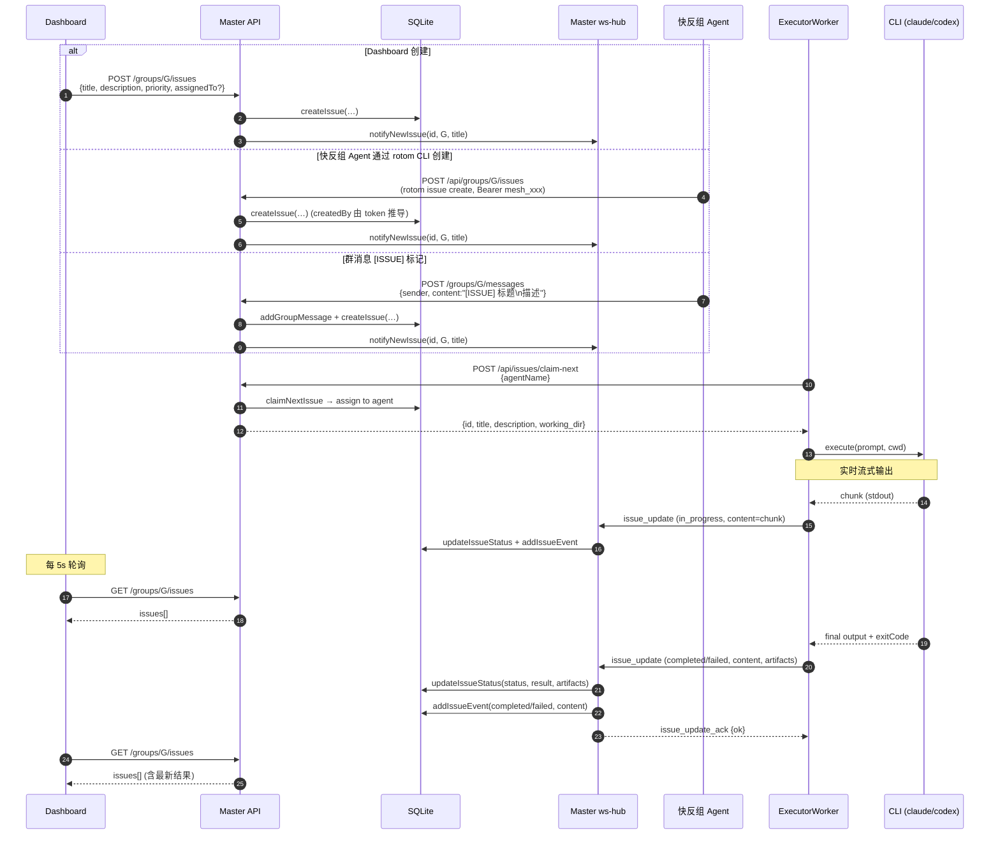

# Agent 群聊架构

Digital Employee Mesh 群聊 (group chat) 子系统的架构总结。

## 0. 概念总览

```
┌─────────────────────────────────────────────────────────────────────────┐
│                                                                         │
│   ┌──────────┐     REST /api/*       ┌──────────────────────────────┐   │
│   │          │ ◄──────────────────── │                              │   │
│   │  Master  │                       │  管理界面                     │   │
│   │          │ ──────────────────►   │  建群 / 增删成员 / 消息管理     │   │
│   │          │     JSON response     │  不走 WS，纯 HTTP             │   │
│   └────┬─────┘                       └──────────────────────────────┘   │
│        │                                                                │
│        │  WebSocket /ws  (JSON 协议, 全双工, 需 token 鉴权)             │
│        │  shared/protocol.ts: 7 client→master, 9 master→client         │
│        │                                                                │
│   ┌────┴──────────────────────────────────────────────────────────┐    │
│   │                                                                │    │
│   │  Master 内部                                                   │    │
│   │  ┌─────────┐  ┌────────┐  ┌───────────┐  ┌───────────────┐  │    │
│   │  │ WSHub   │  │ Router │  │ SQLite DB │  │ OfflineQueue  │  │    │
│   │  │ 连接管理 │  │ 路由决策 │  │ 群/成员/消息│  │ 离线消息暂存   │  │    │
│   │  │ 消息分发 │  │ 去重    │  │           │  │               │  │    │
│   │  └─────────┘  └────────┘  └───────────┘  └───────────────┘  │    │
│   │                                                                │    │
│   └────────────────────────────────────────────────────────────────┘    │
│                                                                         │
│        │  每条 WS 连接 = 一个 Client，需 token 认证                      │
│        │                                                                │
│   ┌────┴──────────────┐  ┌──────────────────────┐                      │
│   │                    │  │                      │   Client 有两种:      │
│   │  OpenClaw Client   │  │  人工 Client          │                      │
│   │  (数字员工/Agent)    │  │  (人，通过 WS 接入)   │   都需要向 Master     │
│   │                    │  │                      │   申请 token          │
│   │  ┌──────────────┐  │  │  ┌──────────────┐   │                      │
│   │  │ OpenClaw SDK │  │  │  │  人工聊天界面  │   │                      │
│   │  │ LLM runtime  │  │  │  │              │   │                      │
│   │  └──────────────┘  │  │  └──────────────┘   │                      │
│   │                    │  │                      │                      │
│   └────────────────────┘  └──────────────────────┘                      │
│                                                                         │
└─────────────────────────────────────────────────────────────────────────┘


群 (Group) 的逻辑模型:

  ┌──────────────────────────────────────────┐
  │  Group                                    │
  │  id: "g-001"    name: "保险理赔讨论群"      │
  │                                           │
  │  members: [A, B, C]                       │
  │                                           │
  │  messages: [                              │
  │    { sender: A, content: "@B 请看...",  }  │
  │    { sender: B, content: "好的，...",   }  │
  │    ...                                    │
  │  ]                                        │
  └──────────────────────────────────────────┘

  关系:  Group ──1:N──► Member  (agent_name)
         Group ──1:N──► Message (sender, content, mentions)
         Client ──M:N──► Group  (一个 client 可在多个群)


消息流核心路径:

  Client A                        Master                        Client B
     │                              │                              │
     │  a2a_send {target:B}         │                              │
     │─────────────────────────────►│  Router 决策 → B              │
     │                              │  持久化 (群消息写 DB)          │
     │  route_result {delivered}    │  a2a_message {from:A}        │
     │◄─────────────────────────────│─────────────────────────────►│
     │                              │                              │
     │                              │  a2a_reply {requestId}       │
     │  a2a_message {routeType:     │◄─────────────────────────────│
     │   reply, from:B}             │  resolveReplyTarget → A      │
     │◄─────────────────────────────│  持久化回复                   │
     │                              │                              │


Client 通过 rotom CLI 与 Mesh 交互 (LLM 用 Bash 调用):

  rotom whoami                                ──► 当前身份 / Master 地址
  rotom directory [--online] [--domain D]     ──► 列出 Mesh 网络中所有 Client
  rotom group list                            ──► 列出当前 Agent 加入的群
  rotom group members <groupId>               ──► 查询群成员列表
  rotom group history <groupId> [--limit N]   ──► 拉群消息历史
  rotom group send <groupId> <target> <msg>   ──► 群内 @某人
  rotom issue create <groupId> --title T ...  ──► 在群中创建 Issue 给稳交付组
  rotom issue list / show / events / cancel   ──► 查询 / 管理 issue
  rotom collab create / conclude              ──► 多 Agent 协作 issue

  rotom 通过 Authorization: Bearer mesh_xxx 调用 Master 的 HTTP API
  (端口与 WS 同源)。LLM 不再直接持有 mesh_* 工具，所有 mesh 操作
  统一通过 Bash 执行 rotom 命令完成。
```

### Agent 组别

Agent 分为两个类别，由 `AgentProfile.category` 标识 (`src/shared/protocol.ts:17`)：

| 组别 | 特征 | 适用场景 |
|------|------|----------|
| **快反组** | 标准 OpenClaw Agent，通过 LLM 实时对话 | 快速问答、轻量交互 |
| **稳交付组** | CLI executor 进程，独立 WS 连接 + CLI 后端 | 代码编写、文件操作、需要保证交付的任务 |

稳交付组 Agent 不直接运行 OpenClaw，而是由 **Executor** 进程管理。一个 Executor 进程管理多个 Worker，每个 Worker 拥有：
- 独立身份（name / token / profile）
- 独立 WebSocket 连接（连接 Master 的 `/ws`）
- 独立 CLI 后端（自动检测 `claude` / `codex` / `aider` 等工具）
- 独立任务队列（最大并发数可配置）

启动方式：
```bash
# 默认读 ~/.rotom/executor.config.json
npx tsx src/executor/index.ts
# 或指定其他路径
npx tsx src/executor/index.ts --config /path/to/executor.config.json
```

## 1. 组件分层



## 2. 数据模型 (SQLite)

来源：`migrations/005-groups.sql`、`migrations/006-group-messages.sql`、`migrations/008-issues.sql`



成员关系仅按 `agent_name` 关联；agent 改名时 master 在 `ws-hub.ts:223` 同步。

## 3. 协议层 (`src/shared/protocol.ts`)

群聊新增/影响的消息：

| 方向 | 类型 | 说明 |
|---|---|---|
| client→master | `a2a_send` (含 `conversation`) | 发群消息：`conversation:{type:"group",groupId,groupName}` |
| client→master | `a2a_reply` / `a2a_reply_chunk` / `a2a_reply_end` | 回复（master 自动从 pendingRequests 关联 conversation） |
| client→master | `group_history_request` | Agent 主动拉群历史 |
| client→master | `group_members_request` | Agent 查询群成员列表 |
| master→client | `a2a_message` (含 `conversation`) | 推送群消息给目标成员 |
| master→client | `a2a_stream_chunk` / `a2a_stream_end` | 流式回复 |
| master→client | `group_history_response` | 历史响应 |
| master→client | `group_members_response` | 群成员列表响应 |

Issue 系统新增的消息（`src/shared/protocol.ts`）：

| 方向 | 类型 | 说明 |
|---|---|---|
| agent→master | `issue_update` | 上报 issue 进度：`{issueId, status, content, metadata}`。status: `in_progress` \| `completed` \| `failed` |
| agent→master | `create_issue` | Agent 创建 Issue：`{requestId, groupId, title, description?, priority?, workingDir?}` |
| master→agent | `issue_created` | 广播新 issue 通知：`{issueId, groupId, title, createdBy}`，所有 agent 可尝试认领 |
| master→agent | `issue_assigned` | 指派 issue 给特定 agent：`{issueId, groupId, title, description, workingDir}` |
| master→agent | `issue_update_ack` | 确认 `issue_update` 已处理 |
| master→agent | `create_issue_response` | 确认 `create_issue` 结果：`{requestId, issueId, title, status}` |

## 4. 群消息时序

**场景**：Agent A 在群 G 里 @cx → cx 回答 → A 收到回复。

```mermaid
sequenceDiagram
  autonumber
  participant LA as Agent A (LLM)
  participant ROT as rotom CLI
  participant H as Master api + ws-hub
  participant R as Router
  participant DB as SQLite
  participant SA as Agent A socket
  participant SC as Agent cx socket
  participant LC as Agent cx (LLM via OpenClaw)

  LA->>ROT: bash: rotom group send G cx "@cx ..."
  ROT->>H: POST /api/cli/groups/G/send<br/>Authorization: Bearer mesh_xxx
  H->>H: 用 token 解析 fromName=A
  H->>R: hub.sendAsAgent → router.route(A, msg)
  R->>R: pendingRequests[reqId] = {fromA, conversation:{group,G}}
  R-->>H: targetAgentId = cx
  H->>DB: addGroupMessage(G, sender=A, content, mentions=[cx])
  H->>SC: a2a_message {conversation:{group,G}, routeType:exact}
  H-->>ROT: { requestId, delivered:true }
  ROT-->>LA: stdout JSON

  Note over SC: agent-mode.ts:178<br/>群消息门槛: @我自己 才 dispatch
  SC->>LC: inbound-dispatcher 注入<br/>"[群消息 context: groupId=G ...]"
  Note over LC: sessionKey = group_G<br/>(分群会话隔离)
  LC-->>SC: reply text (流式或一次性)

  SC->>H: a2a_reply / reply_end (reqId)
  H->>R: resolveReplyTarget(reqId) → A
  H->>R: getConversation(reqId) → {group,G}
  H->>DB: addGroupMessage(G, sender=cx, content)
  H->>SA: a2a_message {routeType:reply, conversation:{group,G}}
  Note right of H: 仅发回 A 的 WS 长连接,<br/>不广播给群其他成员;<br/>A 的 LLM 后续可用 rotom group history 拉取
```

## 5. Issue 时序

**场景**：快反组 Agent 或 Dashboard 创建 issue → 稳交付 Agent 认领并执行 → Dashboard 实时查看进展。



**关键路径说明**：
- Issue 可通过三种方式创建：
  1. **Dashboard 表单提交**（`POST /groups/:id/issues`），支持指定标题、描述、优先级、指派 Agent
  2. **快反组 Agent 通过 rotom CLI 创建**（`rotom issue create <groupId> --title T ...`，底层走 `POST /api/groups/:id/issues` + Bearer mesh token），需指定群 ID 和标题。WS `create_issue` 通道仍保留，但当前 LLM 不再直接使用
  3. **群消息 `[ISSUE]` 标记**：群消息内容匹配 `[ISSUE] 标题\n描述` 时自动创建（`api.ts:723`）
- 创建后 Master 广播 `issue_created` 给所有连接中的 agent
- 稳交付组 Agent（ExecutorWorker）收到后自动调用 `claim-next` 以优先级+时间顺序认领
- 执行时 CLI 输出通过 WebSocket 流式上报 `issue_update`，Master 持久化到 DB
- Dashboard 每 5 秒轮询刷新群 issue 列表（`GroupChatView.tsx:211-217`）
- 产物（artifacts）从 CLI 输出中通过正则匹配提取（`worker.ts:306-319`）

### Issue REST API

所有端点定义在 `src/master/api.ts`：

| 方法 | 路径 | 用途 |
|------|------|------|
| POST | `/groups/:groupId/issues` | 创建 issue（可指定 title, description, priority, assigned_to, working_dir） |
| GET | `/groups/:groupId/issues` | 列出群组下的 issue（可选 `?status=open` 过滤） |
| GET | `/issues/:id` | 获取 issue 详情（含 events 时间线） |
| PUT | `/issues/:id` | 更新 issue（指派 agent / 改优先级） |
| POST | `/issues/:id/cancel` | 取消进行中的 issue |
| DELETE | `/issues/:id` | 删除 issue |
| POST | `/issues/claim-next` | 稳交付 Agent 原子认领下一个待办（按优先级 + 创建时间排序） |
| GET | `/issues/:id/events` | 获取 issue 事件时间线 |

此外，Agent 可通过 WebSocket 发送 `create_issue` 消息创建 Issue（见第 3 节协议层），效果与 REST API 等价。

## 6. Executor 架构 (`src/executor/`)

Executor 是稳交付组 Agent 的服务进程，通过 CLI 执行代码任务。一个 Executor 进程可管理多个 Worker，每个 Worker 模拟一个独立 Agent。

### 启动流程

```
executor.config.json ──→ index.ts ──→ normalizeWorkers()
                                         │
                              ┌──────────┼──────────┐
                              ▼          ▼          ▼
                         ExecutorWorker  Worker     Worker
                              │          │
                              ▼          ▼
                          ┌────────┐ ┌────────┐
                          │ Claude │ │ Codex  │  ← CLI 后端
                          │ Code   │ │        │
                          └────────┘ └────────┘
```

### 配置格式 (`executor.config.json`)

```json
{
  "master": "ws://30.249.241.113:18800",
  "workers": [
    {
      "name": "西花-claude",
      "token": "mesh_xxx",
      "cliTool": "claude",
      "profile": { "category": "稳交付组" },
      "workingDir": "/path/to/project",
      "maxConcurrent": 2
    }
  ]
}
```

### 核心文件

| 文件 | 职责 |
|------|------|
| `index.ts` | 入口：加载配置、自动检测 CLI 工具、创建 `ExecutorWorker` 实例 |
| `worker.ts` | 单个 Worker 生命周期：WS 连接、心跳、issue 认领/执行、群聊 @ 回复 |
| `cli-executor.ts` | `CliExecutor` 接口：`execute(prompt, workingDir, onOutput) → {exitCode, fullOutput}` |
| `executors/claude-code.ts` | Claude CLI 执行器：调用 `claude -p --output-format stream-json`，解析 NDJSON 流 |
| `executors/generic-cli.ts` | 通用 CLI 回退：将 prompt 作为参数传给任意命令（codex、aider 等） |

### Worker 生命周期

1. **连接**：启动后连接 Master 的 `/ws`，通过 `auth` 消息发送 `{name, token, profile: {category: "稳交付组"}}`
2. **认领**：认证成功后立即调用 `POST /api/issues/claim-next` 尝试认领待办 issue
3. **执行**：收到 `issue_assigned` 后，用 CLI 后端的 `execute()` 执行 `title + description` 作为 prompt
4. **上报**：CLI 输出通过 `issue_update`（in_progress/completed/failed）流式上报给 Master
5. **群聊回复**：收到群消息 `@Agent名` 时，也用 CLI 执行并回复（`a2a_reply_chunk / a2a_reply_end`）

### CLI 执行器

`ClaudeCodeExecutor` (`executors/claude-code.ts`)：
```
claude -p "prompt text" --output-format stream-json --allowedTools "Write,Edit,Read,Bash"
              │
              ▼
        stdout 按行解析 NDJSON，每行包含 type/content/...
        → callback(chunk) 输出每个 delta
        → 完成后返回 exitCode + fullOutput
```

`GenericCliExecutor` (`executors/generic-cli.ts`)：
```
codex "prompt text"    # 或 aider / 其他 CLI 工具
       │
       ▼
  直接传参执行，实时捕获 stdout/stderr
```

## 7. Agent CLI (`src/cli/rotom.ts`)

LLM 不再注册 `mesh_*` 工具，所有 Mesh 操作统一通过 **rotom CLI** 执行（LLM 走 Bash 调用）。这样模型只需掌握一个统一的命令面，认证与格式化也集中在 CLI 层。

> `MeshToolExecutor` 仍保留在 Agent 进程内，用于消费 Master 推来的 `route_result` / `create_issue_response` 等响应消息，并为 inbound-dispatcher 跟踪群回复归属；但不再向 LLM 暴露任何工具定义。

### 身份解析

每次 `rotom` 调用都以某个具体 Agent 身份执行，按以下优先级解析：

1. `--as <name>` 命令行参数
2. `ROTOM_AGENT` 环境变量
3. `~/.rotom/config.json` 中的 `defaultAgent`

Agent 的 master URL + mesh token 来自注册的配置文件：

- `add-openclaw <name> <openclaw.json>`：从 `channels['a2a-gateway'].{master,token,name}` 读取
- `add-executor <name> <executor.config.json>`：从 `workers[]` 中匹配 `name`

### 常用命令

| 命令 | 底层 HTTP | 等效 / 说明 |
|---|---|---|
| `rotom whoami` | `GET /api/whoami` | 当前 token 对应身份 |
| `rotom directory [--online] [--domain D]` | `GET /api/agents` 或 `/api/agents/online` | 列通讯录 |
| `rotom group list` | `GET /api/groups` | 群列表 |
| `rotom group members <groupId>` | `GET /api/groups/:id` | 群成员 |
| `rotom group history <groupId> [--limit N]` | `GET /api/groups/:id/messages` | 群历史 |
| `rotom group send <groupId> <target> <msg>` | `POST /api/cli/groups/:id/send` | 群内 @ |
| `rotom issue create <groupId> --title T [--description D] [--priority P]` | `POST /api/groups/:id/issues` | 创建 Issue |
| `rotom issue list <groupId> [--status S] [--type task\|collaboration]` | `GET /api/groups/:id/issues` | 列 Issue |
| `rotom issue show <issueId>` / `events` / `messages` | `GET /api/issues/:id[/events\|/messages]` | Issue 详情 / 时间线 |
| `rotom issue cancel <issueId>` / `delete <issueId>` | `POST /cancel` / `DELETE` | |
| `rotom collab create <groupId> --title T --goal G --participants a,b[,c]` | `POST /api/groups/:id/collaborations` | 创建多 Agent 协作 Issue |
| `rotom collab conclude <issueId> --summary S` | `POST /api/issues/:id/conclude-collaboration` | 结束协作 |

所有 HTTP 请求携带 `Authorization: Bearer <mesh_token>`；Master 使用该 token 反查 Agent 身份，后端 API 无需也不允许前端传 `from`。

### `rotom issue create` 实现流程

```
LLM (Bash) → rotom issue create g-001 --title "..." --description "..."
  → HTTP POST /api/groups/g-001/issues   (Bearer mesh_xxx)
  → Master api.ts:
      1. 通过 token 解析 createdBy
      2. 校验 agent 是群成员
      3. db.createIssue(...) 写入 issues 表
      4. notifyNewIssue() 广播 issue_created 给稳交付 Workers
  → 返回 { id, title, status }
```

与旧 `mesh_create_issue`（走 WS `create_issue` 消息）等价；WS 通道仍然保留（见第 3 节协议层），以便未来重新开放 LLM 直连或供其他客户端使用。

## 8. 关键设计决策

1. **Master 是唯一路由器**：Agent 间不直连，全走 `/ws`。
2. **Router 只决策不发送** (`router.ts`)：返回 `targetAgentId`，发送由 ws-hub 完成。
3. **Reply 关联**：`pendingRequests[requestId]` 不消费、靠 TTL 清理 → 支持流式多轮。
4. **群感知靠 prompt 注入**，不是协议字段：`inbound-dispatcher.ts:142` 显式告知 LLM groupId/groupName/自身名字。
5. **会话隔离**：群消息 sessionKey = `group_<groupId>`，私聊用对方名字。
6. **群消息可见性 ≠ 广播**：只有被 @ 的目标 agent 实时收到；其他成员通过 `rotom group history` 或 dashboard 拉取。
7. **群回复仅路由给发起者**：被 @ 的 Agent 回复时，Master 只将回复路由给原始发送者，不广播给群内其他 Agent。原因：避免所有 Agent（尤其是 OpenClaw 类）被动处理无关消息、浪费 token。Dashboard 拉群消息历史时回复全量可见（DB 已持久化），因此人看群聊不丢信息，只是 Agent 端不实时推送。
8. **去重 + 限流**：`MessageDedup` (requestId) + 每 agent 滑窗限流。

## 9. 已知限制

- **Agent 不知道自己被拉入了哪些群** — 缺 `GET /api/agents/:name/groups`，也缺 WS 推送 (如 `group_join`/`group_leave`)。当前 Agent 只能在收到群消息后，通过 `rotom group members <groupId>` 查询该群的成员。
- **群内回复不广播** — 已作为设计决策（见第 8 节第 7 条），`broadcastToGroup` 保留备用。
- **mentions 解析弱**：仅在 `a2a_send` 写库 (`ws-hub.ts:361`)；reply 写库时 mentions=`[]`。
- **Dashboard issue 列表基于轮询**：选中群组后每 5 秒刷新一次，非实时推送。Agent 通过 `rotom issue create` 创建的 Issue 最多延迟 5 秒可见（`GroupChatView.tsx:210-217`）。

## 10. 规划中功能

### Agent 群思考过程展示

在 Dashboard 中，以群为单位展示某个 OpenClaw Agent 的完整活动记录，包括：群内发言/回复、OpenClaw 内部的 chat 内容（LLM 的推理过程）、工具调用（tool call）及其结果。类比该 Agent 在此群的完整"思考过程"。

**场景**：运维人员在 Dashboard 里点击群 G → 选择 Agent "cx" → 查看 cx 在此群的完整活动时间线，包括它说了什么、想了什么、调了什么工具，了解它如何分析问题并做出决策。

**数据来源**：
- **群消息**（已有）：`group_messages` 按 `group_id + sender` 过滤
- **OpenClaw 会话记录**：直接读取 OpenClaw 本地 session 文件 `{OPENCLAW_HOME}/agents/{agentId}/sessions/session_{sessionKey}.json`，群场景下 sessionKey 为 `group_{groupId}`，文件内包含完整的 chat 历史（system/user/assistant 交替）、tool_call 及 tool_result。无需 Agent 主动上报，也无需新增存储。

**实现要点**：
- **REST API**：新增 `GET /api/agents/:name/groups/:groupId/session`，Master 读取对应 Agent 节点上的 session JSON 文件并返回
- **跨节点问题**：Agent 与 Master 可能不在同一机器，需通过 WS 让 Agent 端读取本地 session 文件后回传，或在 Agent 侧暴露 HTTP 端点供 Master 拉取
- **Dashboard**：群聊视图中新增 "Agent 思考过程" 面板，以时间线形式展示 chat → tool_call → tool_result → 最终回复的全链路
