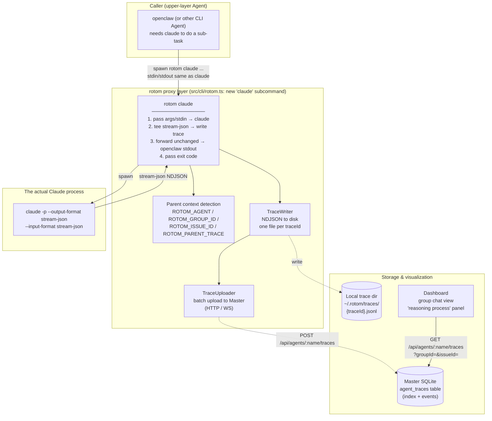
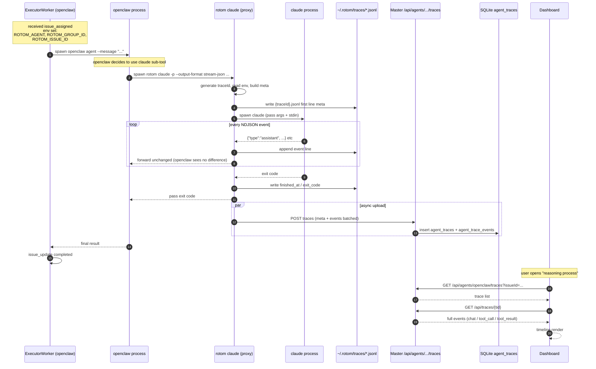

# Agent White-box Architecture

An architecture that extracts **Claude Code's execution process** (chat reasoning / tool calls / tool results) for centralized storage and visualization.

**Core idea**: let openclaw (or any "upper-layer agent") **invoke claude through rotom** as a proxy layer. During forwarding, **capture all stream-json events and persist them**, so the Dashboard can reconstruct claude's full reasoning trace.

> Companion doc: `docs/GROUP_CHAT_ARCHITECTURE.md` (overall group-chat architecture)

## 0. Why this proxy layer is needed

Current state (`src/executor/executors/`):

| Backend | Output protocol | Visibility |
|---------|-----------------|-----------|
| `claude-code.ts` | `claude -p --output-format stream-json` NDJSON | ✅ chat / tool_use / tool_result all visible |
| `openclaw.ts` | openclaw's own NDJSON (text / tool_use / tool_result / lifecycle) | ✅ visible to itself |
| `codex.ts` / `generic-cli.ts` | pure stdout | ❌ invisible |

But there's a **blind spot**: when openclaw **calls claude internally as a sub-tool**, that claude execution only exposes openclaw's "text output" to the outside — **claude's own chat/tool chain is lost**. The Dashboard sees openclaw's finished product, not how claude reached that conclusion.

Solution: **openclaw doesn't spawn `claude` directly, it spawns `rotom claude ...`**. rotom acts as middleman:
1. Forward args / stdin to the real `claude` process
2. **Parse claude's stream-json output**, persist every event to trace storage, then pass it through unchanged to openclaw
3. The trace carries **parent context** (who called it, which issue / group it belongs to)
4. Dashboard / Master can later query claude's execution details by `parent agent × group × issue`

## 1. Overall architecture



## 2. Key design

### 2.1 Transparent proxy: rotom's stdin/stdout matches claude exactly

Callers don't see rotom — just replace `claude` with `rotom claude`:

```bash
# openclaw internals before
claude -p --output-format stream-json --input-format stream-json --resume <sid>

# now
rotom claude -p --output-format stream-json --input-format stream-json --resume <sid>
#     ^^^^^^ one prefix only; args/stdin/stdout fully transparent
```

Implementation: `rotom claude` passes through every flag except its own to `claude`; stdin pipe-through; stdout teed — written to trace and forwarded upstream.

> Same proxy pattern can extend to `rotom codex`, `rotom aider` — not detailed here.

### 2.2 Trace data model

Each "openclaw → rotom → claude" run produces one trace:

```ts
interface AgentTrace {
  traceId: string;                 // unique ID for this proxy run (rotom-generated)
  parentAgent: string;             // who initiated (openclaw's agent name, from ROTOM_AGENT)
  innerTool: "claude" | "codex";   // the proxied CLI
  innerSessionId?: string;         // claude --resume / system event's session_id
  groupId?: string;                // ROTOM_GROUP_ID
  issueId?: string;                // ROTOM_ISSUE_ID
  parentTraceId?: string;          // outer trace when nested — supports "trace tree"
  startedAt: string;
  finishedAt?: string;
  exitCode?: number;
  events: TraceEvent[];            // full stream-json events + timestamps
}

interface TraceEvent {
  ts: number;
  // keep claude stream-json's original shape — front-end reuses existing logic
  type: "system" | "assistant" | "user" | "result";
  raw: unknown;
}
```

On-disk format: `~/.rotom/traces/{traceId}.jsonl` — first line meta, then one event per line. **NDJSON so we can read while writing and resume on interruption.**

### 2.3 How parent context is injected

When openclaw / upper-layer worker spawns `rotom claude`, context flows via **env vars**:

| Env var | Set by | Purpose |
|---------|--------|---------|
| `ROTOM_AGENT` | ExecutorWorker when spawning openclaw (already exists) | Identifies the calling agent |
| `ROTOM_GROUP_ID` | **New**: worker injects when handling group messages / issues | Associate to group |
| `ROTOM_ISSUE_ID` | **New**: worker injects when executing an issue | Associate to issue |
| `ROTOM_PARENT_TRACE` | **New**: set by outer rotom on nested proxy calls | Forms trace tree |
| `ROTOM_TRACE_DISABLE` | **New** (optional) | Disable tracing (perf / privacy) |

> openclaw doesn't change at all — as long as env vars are present, traces attach to the right group/issue.

### 2.4 Storage layering: local first, Master async-aggregated

```
┌─────────────────────────────────────────────────────────────┐
│  rotom claude process                                         │
│   ┌──────────────────────────────────────────────┐          │
│   │ Real-time tee: every stream-json event         │          │
│   │   ① forward to openclaw stdout (sync, no block)│         │
│   │   ② append to local ~/.rotom/traces/{tid}.jsonl│         │
│   └──────────────────────────────────────────────┘          │
│                         │                                     │
│                         ▼ (process exit / periodic flush)     │
│   ┌──────────────────────────────────────────────┐          │
│   │ TraceUploader (background / batch)             │          │
│   │   POST {master}/api/agents/{parentAgent}/traces│         │
│   │   failure → stays local, retries on next start │         │
│   └──────────────────────────────────────────────┘          │
└─────────────────────────────────────────────────────────────┘
                          │
                          ▼
        Master: agent_traces table (index) + events BLOB / JSONL reference
```

Design points:
- **Doesn't block the caller**: local disk write is sync (NDJSON append is fast); Master upload is **async**
- **Cross-node friendly**: when Executor is remote, Dashboard still pulls full trace from Master DB — no need to WS-fetch local files
- **Degradation path**: when Master is unreachable, trace stays local; `rotom` auto-uploads on next start

### 2.5 Master side: new tables + REST

`migrations/00X-agent-traces.sql` (new):

```sql
CREATE TABLE agent_traces (
  trace_id          TEXT PRIMARY KEY,
  parent_agent      TEXT NOT NULL,
  inner_tool        TEXT NOT NULL,     -- 'claude' | 'codex' | ...
  inner_session_id  TEXT,
  group_id          TEXT,
  issue_id          TEXT,
  parent_trace_id   TEXT,
  started_at        TEXT NOT NULL,
  finished_at       TEXT,
  exit_code         INTEGER,
  event_count       INTEGER DEFAULT 0
);
CREATE INDEX idx_traces_agent_group ON agent_traces(parent_agent, group_id);
CREATE INDEX idx_traces_issue ON agent_traces(issue_id);

CREATE TABLE agent_trace_events (
  id          INTEGER PRIMARY KEY AUTOINCREMENT,
  trace_id    TEXT NOT NULL REFERENCES agent_traces(trace_id) ON DELETE CASCADE,
  ts          INTEGER NOT NULL,
  type        TEXT NOT NULL,           -- 'system' | 'assistant' | 'user' | 'result'
  raw         TEXT NOT NULL            -- raw stream-json line
);
CREATE INDEX idx_trace_events ON agent_trace_events(trace_id, id);
```

REST:

| Method | Path | Purpose |
|--------|------|---------|
| POST | `/api/agents/:name/traces` | rotom uploads trace (meta + events, batchable) |
| GET | `/api/agents/:name/traces?groupId=&issueId=` | Dashboard lists traces |
| GET | `/api/traces/:traceId` | Pull a single trace's event stream (paginated) |

## 3. Timeline: a full openclaw → claude-via-rotom run



## 4. Dashboard timeline render

Reuses the existing tool-tag parser in `packages/dashboard/.../MarkdownContent.tsx` (the `[tool:exec]` / `[tool:patch]` / `[tool-result:exec]` vocabulary described in `claude-code.ts:411` comments).

Trace event mapping:
- claude `system` event → header info (model / session_id)
- claude `assistant` with text → 💬 chat
- claude `assistant` with tool_use → 🔧 tool_call (reuses `describeToolUseForLog` classification: exec / patch / ask)
- claude `user` with tool_result → 📤 tool_result (exec shown, patch collapsed)
- claude `result` → ✅ completion marker

In group chat view: beside an openclaw reply, users can open a "view claude's reasoning process" drawer that loads the trace list for that issue/message.

## 5. Key change list

| Module | File | Change |
|--------|------|--------|
| **rotom CLI** | `src/cli/rotom.ts` | New `claude` subcommand (later `codex` same pattern) |
| **rotom CLI** | `src/cli/trace-writer.ts` (new) | TraceWriter: local NDJSON write |
| **rotom CLI** | `src/cli/trace-uploader.ts` (new) | Background batch upload + retry |
| **Executor** | `src/executor/worker.ts` | Inject `ROTOM_GROUP_ID` / `ROTOM_ISSUE_ID` when spawning subprocess |
| **openclaw adapter** | upstream openclaw config (out of repo) | Replace internal `claude` with `rotom claude` |
| **Master DB** | `migrations/00X-agent-traces.sql` | New tables `agent_traces` / `agent_trace_events` |
| **Master API** | `src/master/api.ts` | New REST: POST/GET traces |
| **Dashboard** | `packages/dashboard/src/features/.../` | Group chat view adds "reasoning process" drawer |
| **Protocol** | `src/shared/protocol.ts` | WS unchanged for now; trace goes via HTTP |

## 6. Phased rollout

| Phase | Scope | Value |
|-------|-------|-------|
| **P0** | rotom claude proxy + local NDJSON write (no Master sync); local CLI can query trace | Minimum loop; verify forwarding doesn't break openclaw |
| **P1** | TraceUploader → Master DB → Dashboard list + single trace detail | Cross-node visualization |
| **P2** | Trace tree (nested proxy); aggregated views by issue / group chat | Multi-agent collaboration observability |
| **P3** | rotom codex / rotom aider via same pattern; trace search / full-text | Multi-CLI unified white-box |

## 7. Relationship to existing systems

- **Doesn't break callers**: `rotom claude` is a new subcommand; old `claude` direct calls still work
- **Doesn't pollute `group_messages`**: trace lives in its own `agent_traces` table, related via group_id/issue_id
- **Orthogonal to Issue system**: issues already have `issue_events`; traces can be merged in Dashboard view
- **Compatible with `SessionStore`**: `~/.rotom/sessions.json` still maintains `cliTool × sessionKey → sessionId`; when rotom claude passes through `--resume`, the trace's `innerSessionId` aligns

## 8. Known risks

- **Perf**: one extra process fork + NDJSON parse. stream-json events are usually <10KB; measured overhead is negligible, but needs benchmarking
- **Stdin pass-through**: when openclaw uses stream-json input, rotom must pipe stdin without buffering, or claude stalls waiting for input
- **Exit codes / signals**: SIGTERM / SIGKILL must propagate to claude; proxy layer must not swallow abort signals
- **Storage bloat**: long sessions can produce MB-level traces; need a TTL strategy (both local and Master)
- **Privacy**: traces contain full prompts / tool inputs / outputs — may include sensitive data; Master needs permission checks (who can view which agent's traces)
- **PATH detection**: `rotom claude` must locate the real `claude` executable via `which claude` — avoid recursing into itself
