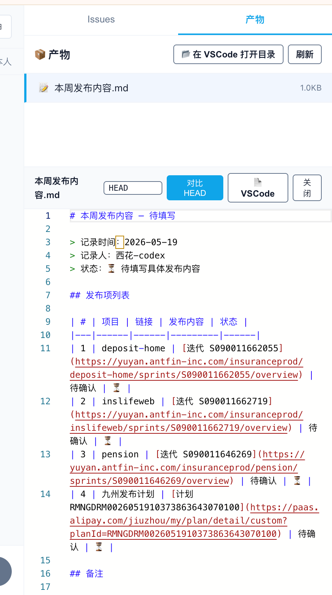

- [x] 1. 创建了issue后是直接分配的，需要改成我来指派的
- [x] 2. 产物查看这里的样式有问题 
- [ ] 3. 每个agent可以指定在群内的职责，比如你的职责是记录工作项、你的职责是完成这部分工作等，这个内容要带到消息里面，字符需要有限制，36以内
- [ ] 4. issue 执行过程中透出权限请求、方案选择等，先做codex的，后续还要做 claudecode 的
