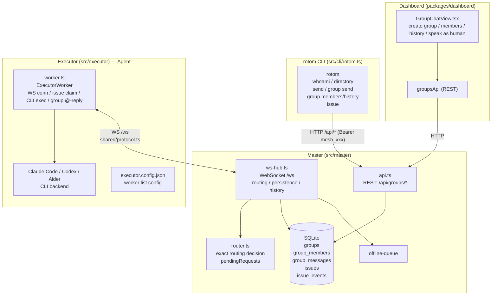
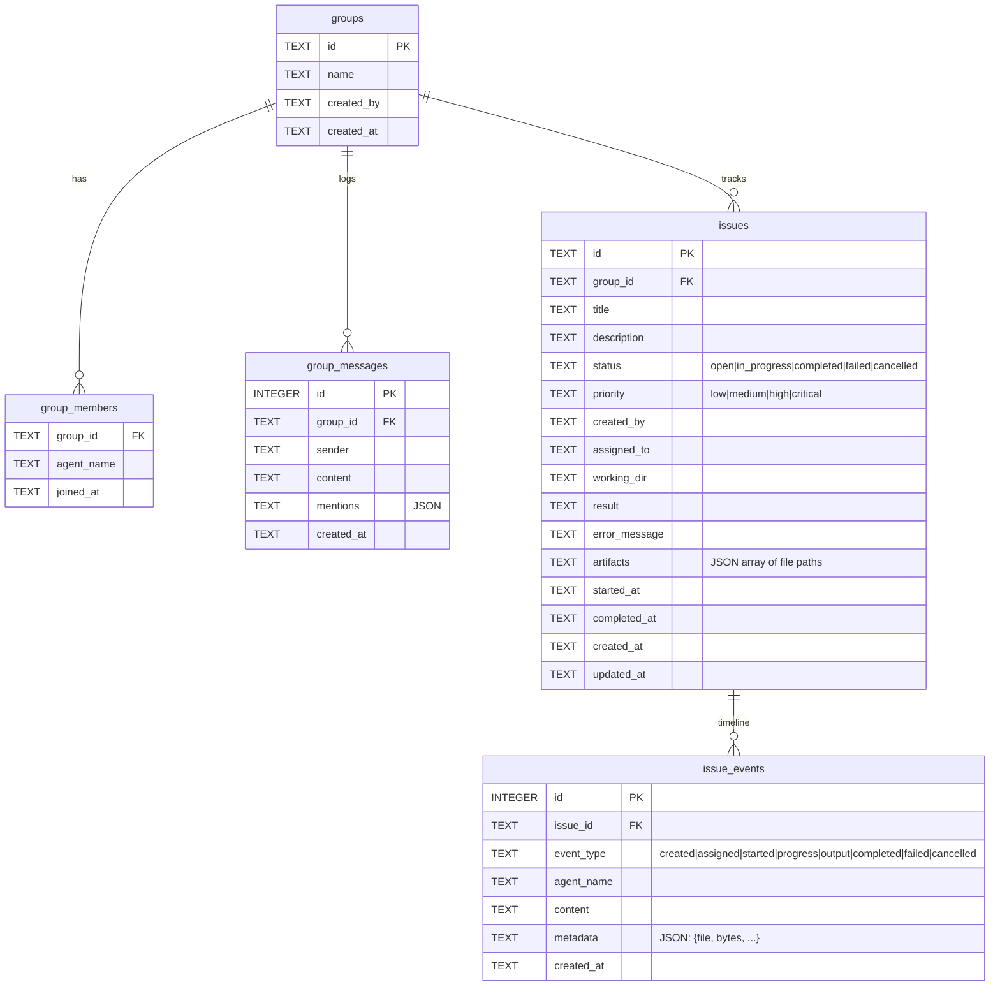
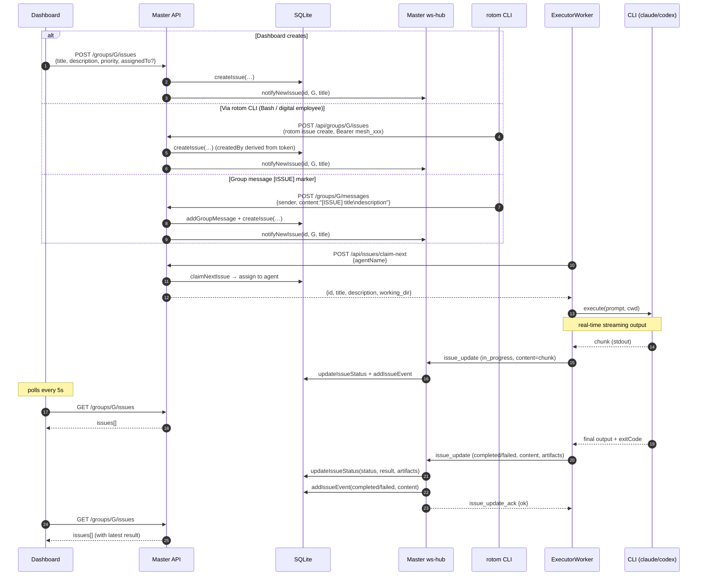

# Agent Group Chat Architecture

Architecture summary for the Digital Employee Mesh group chat subsystem.

## 0. Concept overview

```
┌─────────────────────────────────────────────────────────────────────────┐
│                                                                         │
│   ┌──────────┐     REST /api/*       ┌──────────────────────────────┐   │
│   │          │ ◄──────────────────── │                              │   │
│   │  Master  │                       │  Admin UI                    │   │
│   │          │ ──────────────────►   │  create group / members /    │   │
│   │          │     JSON response     │  message mgmt — HTTP only    │   │
│   └────┬─────┘                       └──────────────────────────────┘   │
│        │                                                                │
│        │  WebSocket /ws  (JSON, full-duplex, token auth)                │
│        │  shared/protocol.ts: 7 client→master, 9 master→client          │
│        │                                                                │
│   ┌────┴──────────────────────────────────────────────────────────┐    │
│   │                                                                │    │
│   │  Master internals                                              │    │
│   │  ┌─────────┐  ┌────────┐  ┌───────────┐  ┌───────────────┐  │    │
│   │  │ WSHub   │  │ Router │  │ SQLite DB │  │ OfflineQueue  │  │    │
│   │  │ conns   │  │ routing│  │ group/    │  │ offline msgs  │  │    │
│   │  │ dispatch│  │ dedup  │  │ member/msg│  │               │  │    │
│   │  └─────────┘  └────────┘  └───────────┘  └───────────────┘  │    │
│   │                                                                │    │
│   └────────────────────────────────────────────────────────────────┘    │
│                                                                         │
│        │  Each WS connection = one Client, requires token              │
│        │                                                                │
│   ┌──────────────────────┐  ┌──────────────────────┐                   │
│   │                      │  │                      │  Two client types: │
│   │  Executor (Agent)    │  │  Human client         │                   │
│   │  (digital employee   │  │  (human, Dashboard/WS)│  Both apply for   │
│   │   service process)   │  │                      │  tokens from       │
│   │                      │  │                      │  Master            │
│   │  ┌────────────────┐  │  │  ┌──────────────┐   │                   │
│   │  │ ExecutorWorker  │  │  │  │  Dashboard / │   │                   │
│   │  │ manages workers │  │  │  │ human chat UI│   │                   │
│   │  │ CLI backend     │  │  │  │              │   │                   │
│   │  └────────────────┘  │  │  └──────────────┘   │                   │
│   │                      │  │                      │                   │
│   └──────────────────────┘  └──────────────────────┘                   │
│                                                                         │
└─────────────────────────────────────────────────────────────────────────┘
```

Group logical model:

```
┌──────────────────────────────────────────┐
│  Group                                    │
│  id: "g-001"    name: "Insurance claim"   │
│                                           │
│  members: [A, B, C]                       │
│                                           │
│  messages: [                              │
│    { sender: A, content: "@B please...",} │
│    { sender: B, content: "ok, ...",    }  │
│    ...                                    │
│  ]                                        │
└──────────────────────────────────────────┘

Relations: Group ──1:N──► Member  (agent_name)
           Group ──1:N──► Message (sender, content, mentions)
           Client ──M:N──► Group  (a client may be in many groups)
```

Core message flow:

```
Client A                     Master                     Client B
   │                            │                            │
   │  a2a_send {target:B}       │                            │
   │───────────────────────────►│  Router decides → B        │
   │                            │  persist (write to DB)     │
   │  route_result {delivered}  │  a2a_message {from:A}      │
   │◄───────────────────────────│───────────────────────────►│
   │                            │                            │
   │                            │  a2a_reply {requestId}     │
   │  a2a_message {routeType:   │◄───────────────────────────│
   │   reply, from:B}           │  resolveReplyTarget → A    │
   │◄───────────────────────────│  persist reply             │
   │                            │                            │
```

Client interacts with Mesh via rotom CLI (LLM calls via Bash):

```
rotom whoami                                ──► current identity / Master URL
rotom directory [--online] [--domain D]     ──► list all Clients in Mesh
rotom group list                            ──► list groups the current Agent joined
rotom group members <groupId>               ──► list group members
rotom group history <groupId> [--limit N]   ──► fetch message history
rotom group send <groupId> <target> <msg>   ──► @someone in the group
rotom issue create <groupId> --title T ...  ──► create an Issue for Agents to claim
rotom issue list / show / events / cancel   ──► query / manage issues

rotom calls Master's HTTP API with Authorization: Bearer mesh_xxx
(same origin as WS). LLMs no longer hold mesh_* tools directly — every mesh
operation goes through Bash → rotom.
```

### Agents vs humans

Agents are the unified "employee" concept, hosted by the `executor` process (`src/executor/`). One Executor manages multiple Workers; each Worker has:
- Independent identity (name / token / profile)
- Independent WebSocket connection (to Master's `/ws`)
- Independent CLI backend (auto-detects `claude` / `codex` / `aider`)
- Independent task queue (configurable max concurrency)

`AgentProfile.category` (`src/shared/protocol.ts`) currently has one special value:
- `"真人"` (Human) — real human team member; can be an Issue owner / approver; doesn't participate in Issue claiming
- Others (including unset) — normal Agent; auto-dispatched / assignable / replies via CLI backend on group @-mention

Startup:
```bash
# Default reads ~/.rotom/executor.config.json
npx tsx src/executor/index.ts
# Or specify a different path
npx tsx src/executor/index.ts --config /path/to/executor.config.json
```

## 1. Component layering



## 2. Data model (SQLite)

Sources: `migrations/005-groups.sql`, `migrations/006-group-messages.sql`, `migrations/008-issues.sql`



Membership relations are by `agent_name`; when an agent renames, master syncs at `ws-hub.ts:223`.

## 3. Protocol layer (`src/shared/protocol.ts`)

Messages added/affected for group chat:

| Direction | Type | Notes |
|-----------|------|-------|
| client→master | `a2a_send` (with `conversation`) | Send group message: `conversation:{type:"group",groupId,groupName}` |
| client→master | `a2a_reply` / `a2a_reply_chunk` / `a2a_reply_end` | Reply (master auto-associates conversation from pendingRequests) |
| master→client | `a2a_message` (with `conversation`) | Push group message to target member |
| master→client | `a2a_stream_chunk` / `a2a_stream_end` | Streaming reply |

> Group history / group members are now fetched via rotom CLI over HTTP — no longer via WS request/response.

Issue-system messages added (`src/shared/protocol.ts`):

| Direction | Type | Notes |
|-----------|------|-------|
| agent→master | `issue_update` | Report issue progress: `{issueId, status, content, metadata}`. status: `in_progress` \| `completed` \| `failed` |
| agent→master | `issue_approval_request` | Worker-side CLI requests a write-tool approval |
| master→agent | `issue_created` | Broadcast new issue notification: `{issueId, groupId, title, createdBy}` |
| master→agent | `issue_assigned` | Assign issue to a specific agent: `{issueId, groupId, title, description, workingDir, slashCommand?, approvalPolicy?}` |
| master→agent | `issue_update_ack` | Acknowledge `issue_update` processed |
| master→agent | `issue_approval_response` | Decision on `issue_approval_request` |
| master→agent | `issue_continue` / `issue_append` | Follow-up: append prompt after completion / append during in-progress |
| master→agent | `issue_cancelled` | Notify to abort current CLI process |
| master→agent | `issue_changed` | Broadcast issue state change to the whole group; dashboard uses it to stop polling |

## 4. Group message timeline

**Scenario**: Agent A @-mentions cx in group G → cx answers → A receives the reply.

```mermaid
sequenceDiagram
  autonumber
  participant LA as Agent A (LLM)
  participant ROT as rotom CLI
  participant H as Master api + ws-hub
  participant R as Router
  participant DB as SQLite
  participant SA as Agent A socket
  participant EW as ExecutorWorker (Agent cx)
  participant CLI as CLI backend (claude/codex)

  LA->>ROT: bash: rotom group send G cx "@cx ..."
  ROT->>H: POST /api/cli/groups/G/send<br/>Authorization: Bearer mesh_xxx
  H->>H: resolve fromName=A from token
  H->>R: hub.sendAsAgent → router.route(A, msg)
  R->>R: pendingRequests[reqId] = {fromA, conversation:{group,G}}
  R-->>H: targetAgentId = cx
  H->>DB: addGroupMessage(G, sender=A, content, mentions=[cx])
  H->>EW: a2a_message {conversation:{group,G}, routeType:exact}
  H-->>ROT: { requestId, delivered:true }
  ROT-->>LA: stdout JSON

  Note over EW: worker.ts:338<br/>group message threshold: only @-mention triggers reply
  EW->>EW: injectGroupContext()<br/>inject group metadata + active issue
  Note over EW: sessionStore.get(cliTool, group_G)<br/>restore CLI session context
  EW->>CLI: execute(prompt, workingDir, sessionId)
  CLI-->>EW: streamed output (chunks)
  EW-->>EW: sendChatChunk(requestId, delta)

  EW->>H: a2a_reply / reply_end (reqId)
  H->>R: resolveReplyTarget(reqId) → A
  H->>R: getConversation(reqId) → {group,G}
  H->>DB: addGroupMessage(G, sender=cx, content)
  H->>SA: a2a_message {routeType:reply, conversation:{group,G}}
  Note right of H: Sent only to A's WS long-lived conn,<br/>not broadcast to other group members;<br/>A's LLM can later use `rotom group history` to fetch
```

## 5. Issue system



**Key path notes**:
- Issues can be created via three ways:
  1. **Dashboard form submit** (`POST /groups/:id/issues`) — supports title, description, priority, assigned agent
  2. **Via rotom CLI** (`rotom issue create <groupId> --title T ...`, hits `POST /api/groups/:id/issues` + Bearer mesh token), requires group ID and title. Both Bash digital employees and Dashboard go through this path.
  3. **Group message `[ISSUE]` marker**: when content matches `[ISSUE] title\ndescription`, auto-created (`api.ts:723`)
- After creation, Master broadcasts `issue_created` to all connected agents
- Agents (ExecutorWorker) call `claim-next` automatically, ordered by priority + time
- During execution, CLI output streams to Master via `issue_update` and persists to DB
- Dashboard polls the group's issue list every 5s (`GroupChatView.tsx:211-217`)
- Artifacts are extracted from CLI output via regex (`worker.ts:306-319`)

### Issue REST API

All endpoints defined in `src/master/api.ts`:

| Method | Path | Purpose |
|--------|------|---------|
| POST | `/groups/:groupId/issues` | Create issue (title, description, priority, assigned_to, working_dir) |
| GET | `/groups/:groupId/issues` | List issues in group (optional `?status=open` filter) |
| GET | `/issues/:id` | Issue detail (with events timeline) |
| PUT | `/issues/:id` | Update issue (assign agent / change priority) |
| POST | `/issues/:id/cancel` | Cancel in-progress issue |
| DELETE | `/issues/:id` | Delete issue |
| POST | `/issues/claim-next` | Agent atomically claims next todo (sorted by priority + creation time) |
| GET | `/issues/:id/events` | Get issue event timeline |

Agents can also create Issues via the `create_issue` WS message (see §3 protocol layer); equivalent to the REST API.

## 6. Executor architecture (`src/executor/`)

Executor is the Agent service process; runs code tasks via CLI. One Executor can manage multiple Workers; each Worker emulates an independent Agent.

### Startup flow

```
executor.config.json ──→ index.ts ──→ normalizeWorkers()
                                         │
                              ┌──────────┼──────────┐
                              ▼          ▼          ▼
                         ExecutorWorker  Worker     Worker
                              │          │
                              ▼          ▼
                          ┌────────┐ ┌────────┐
                          │ Claude │ │ Codex  │  ← CLI backends
                          │ Code   │ │        │
                          └────────┘ └────────┘
```

### Config format (`executor.config.json`)

```json
{
  "master": "ws://30.249.241.113:28800",
  "workers": [
    {
      "name": "team-claude",
      "token": "mesh_xxx",
      "cliTool": "claude",
      "workingDir": "/path/to/project",
      "maxConcurrent": 2
    }
  ]
}
```

### Core files

| File | Responsibility |
|------|----------------|
| `index.ts` | Entry: load config, auto-detect CLIs, create `ExecutorWorker` instances |
| `worker.ts` | Single Worker lifecycle: WS connection, heartbeat, issue claim/exec, group @-reply |
| `cli-executor.ts` | `CliExecutor` interface: `execute(prompt, workingDir, onOutput) → {exitCode, fullOutput}` |
| `executors/claude-code.ts` | Claude CLI executor: calls `claude -p --output-format stream-json`, parses NDJSON stream |
| `executors/generic-cli.ts` | Generic CLI fallback: passes prompt as arg to any command (codex, aider, etc.) |

### Worker lifecycle

1. **Connect**: on start, connects to Master's `/ws`, sends `auth` with `{name, token, profile}`
2. **Claim**: after auth, immediately calls `POST /api/issues/claim-next` to claim a pending issue
3. **Execute**: on `issue_assigned`, uses the CLI backend's `execute()` to run `title + description` as prompt
4. **Report**: CLI output streams to Master via `issue_update` (in_progress/completed/failed)
5. **Group reply**: on group message `@AgentName`, also uses the CLI to execute and reply (`a2a_reply_chunk / a2a_reply_end`)

### CLI executors

`ClaudeCodeExecutor` (`executors/claude-code.ts`):
```
claude -p "prompt text" --output-format stream-json --allowedTools "Write,Edit,Read,Bash"
              │
              ▼
        stdout parsed line-by-line as NDJSON; each line has type/content/...
        → callback(chunk) emits each delta
        → returns exitCode + fullOutput on completion
```

`GenericCliExecutor` (`executors/generic-cli.ts`):
```
codex "prompt text"    # or aider / other CLI tools
       │
       ▼
  Pass directly as arg, capture stdout/stderr in real time
```

## 7. Agent CLI (`src/cli/rotom.ts`)

All Mesh operations go through **rotom CLI** (digital employees call via Bash). This way the model only needs to learn one command surface; auth and formatting centralize in the CLI layer.

### Identity resolution

Each `rotom` invocation acts as a specific Agent, resolved by priority:

1. `--as <name>` CLI arg
2. `ROTOM_AGENT` env var
3. `~/.rotom/config.json` `defaultAgent`

The agent's master URL + mesh token come from registered configs:

- `add-executor <name> <executor.config.json>`: matches `name` from `workers[]`

### Common commands

| Command | Underlying HTTP | Equivalent / Notes |
|---------|-----------------|--------------------|
| `rotom whoami` | `GET /api/whoami` | Current token's identity |
| `rotom directory [--online] [--domain D]` | `GET /api/agents` or `/api/agents/online` | List directory |
| `rotom group list` | `GET /api/groups` | Group list |
| `rotom group members <groupId>` | `GET /api/groups/:id` | Group members |
| `rotom group history <groupId> [--limit N]` | `GET /api/groups/:id/messages` | Group history |
| `rotom group send <groupId> <target> <msg>` | `POST /api/cli/groups/:id/send` | @-mention in group |
| `rotom issue create <groupId> --title T [--description D] [--priority P]` | `POST /api/groups/:id/issues` | Create Issue |
| `rotom issue list <groupId> [--status S] [--type task]` | `GET /api/groups/:id/issues` | List Issues |
| `rotom issue show <issueId>` / `events` / `messages` | `GET /api/issues/:id[/events\|/messages]` | Issue detail / timeline |
| `rotom issue cancel <issueId>` / `delete <issueId>` | `POST /cancel` / `DELETE` | |

All HTTP requests carry `Authorization: Bearer <mesh_token>`; Master uses the token to look up the Agent identity — backend APIs neither need nor allow the front-end to pass `from`.

### `rotom issue create` implementation flow

```
LLM (Bash) → rotom issue create g-001 --title "..." --description "..."
  → HTTP POST /api/groups/g-001/issues   (Bearer mesh_xxx)
  → Master api.ts:
      1. resolve createdBy from token
      2. verify the agent is a group member
      3. db.createIssue(...) writes to issues table
      4. notifyNewIssue() broadcasts issue_created to Workers
  → returns { id, title, status }
```

Equivalent to the old `mesh_create_issue` (which went through WS `create_issue`); the WS channel is retained (see §3 protocol layer) for future LLM direct-connect or other clients.

## 8. Key design decisions

1. **Master is the only router**: agents don't peer-connect; everything goes through `/ws`.
2. **Router decides but doesn't send** (`router.ts`): returns `targetAgentId`; sending is done by ws-hub.
3. **Reply association**: `pendingRequests[requestId]` is not consumed, cleaned by TTL → supports multi-turn streaming.
4. **Group awareness via prompt injection, not protocol fields**: `inbound-dispatcher.ts:142` explicitly tells the LLM groupId / groupName / own name.
5. **Session isolation**: group message sessionKey = `group_<groupId>`; private chat uses the counterpart's name.
6. **Group messages broadcast to the whole group**: all group-message paths (`a2a_send` group branch, `a2a_reply` / `_chunk` / `_end`, `sendAsAgent` group branch, `POST /api/groups/:id/messages`) call `WSHub.broadcastToGroup(groupId, msg, [excludeIds])` to push to all group members; the exclude list includes at least the sender + targeted agent (to prevent duplicates). DB still persists via `addGroupMessage`. Dashboard pulls group message history in full; Agent / Dashboard real-time push no longer needs polling.
7. **broadcastToGroup depends on group_members**: every member must be in the `group_members` table (via `POST /api/groups/:id/members` or backend fallback `addGroupMembers`) to be pushed. If the sender isn't in the member table, the backend auto-calls `addGroupMembers` (`INSERT OR IGNORE` idempotent) before broadcast — prevents "self-excitation message loss" + "multi-tab human can't see their own messages".
8. **Dedup + rate limit**: `MessageDedup` (requestId) + sliding-window rate limit per agent.

## 9. Known limitations

- **Agents don't know which groups they're in** — missing `GET /api/agents/:name/groups`, also missing WS pushes (like `group_join`/`group_leave`). Currently, an Agent can only query a group's members after receiving a group message, via `rotom group members <groupId>`.
- **In-group replies not broadcast** — historical description; current implementation broadcasts to the whole group (see §8 item 6); `broadcastToGroup` is the default path.
- **Weak mentions parsing**: only at `a2a_send` write-time (`ws-hub.ts:361`); at reply write-time, mentions=`[]`.
- **Dashboard issue list is poll-based**: refreshes every 5s after selecting a group, not real-time push. Issues created via `rotom issue create` are visible within ~5s (`GroupChatView.tsx:210-217`).

## 10. Planned features

### Agent "thinking process" panel in groups

In the Dashboard, show a per-group, per-Agent full activity record — including group messages / replies, CLI backend chat content (LLM reasoning), tool calls and results. A complete "thinking process" for that Agent in that group.

**Scenario**: an ops person opens Dashboard → clicks group G → picks Agent "cx" → sees cx's full activity timeline in this group: what it said, what it thought, what tools it called, how it analyzed the problem and reached decisions.

**Data sources**:
- **Group messages** (existing): `group_messages` filtered by `group_id + sender`
- **Executor session records**: Executor's `SessionStore` (`~/.rotom/sessions.json`) persists per-CLI-backend group sessionIds; the CLI backend (e.g. Claude Code) local session file contains the full chat history. No Agent-active reporting, no new storage needed.

**Implementation points**:
- **REST API**: add `GET /api/agents/:name/groups/:groupId/session`; via WS, have ExecutorWorker read the local session file and return it
- **Cross-node issue**: Agent (Executor) and Master may not be on the same machine — needs WS to have Executor read the local session file and return; or expose an HTTP endpoint on Executor for Master to fetch
- **Dashboard**: add an "Agent thinking process" panel in the group chat view, showing the full chain chat → tool_call → tool_result → final reply as a timeline
